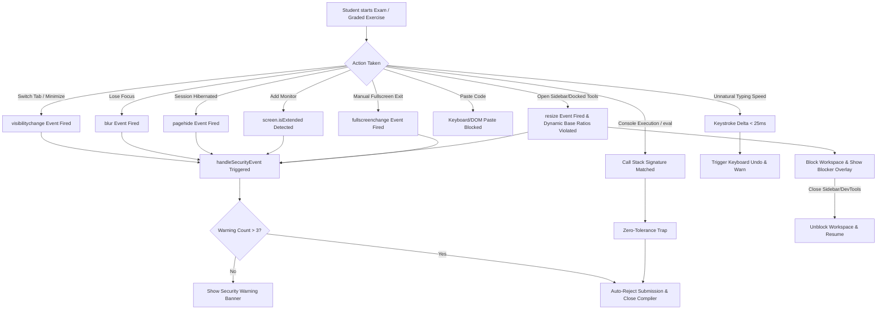

# JS-Mentor Anti-Cheat Proctoring Engine

This document provides a comprehensive technical overview of the **Anti-Cheat Proctoring Engine** implemented in the JS-Mentor platform. It outlines the core detection mechanics, details browser-specific AI sidebar handling, analyzes potential edge cases, and provides recommendations for future security enhancements.

---

## 1. Architectural Overview

The JS-Mentor Anti-Cheat Proctoring Engine is a client-side security subsystem designed to ensure academic integrity during high-stakes assessments (e.g., Graded Exercises and the Final Exam). It operates on a multi-layered security model that continuously monitors the user's focus, window state, viewport dimensions, and inputs.



The proctoring engine is primarily implemented in:
*   [`src/pages/FinalExamPage.js`](file:///d:/Apoliums%203/JS-Mentor/src/pages/FinalExamPage.js) (Manages active exam portal and triggers fullscreen)
*   [`src/pages/LearningPathTopic.js`](file:///d:/Apoliums%203/JS-Mentor/src/pages/LearningPathTopic.js) (Triggers fullscreen for graded coding challenges)
*   [`src/components/common/ExerciseCompiler.js`](file:///d:/Apoliums%203/JS-Mentor/src/components/common/ExerciseCompiler.js) (Monaco paste interception and unmount fullscreen cleanup)
*   [`src/hooks/useAntiCheat.js`](file:///d:/Apoliums%203/JS-Mentor/src/hooks/useAntiCheat.js) (Tab visibility, window focus, custom key blocking, multi-screen detection, and zero-tolerance console execution traps)

---

## 2. Core Security Mechanics

### A. Forced Fullscreen & Exit Detection [IMPLEMENTED]
To prevent students from placing browser tabs side-by-side (snapping windows) or referencing external materials, the engine forces fullscreen mode:
1. **Enforced Launch**: When beginning the final exam or opening an exercise, `document.documentElement.requestFullscreen()` is executed. This forces the browser to take over the user's entire physical screen, hiding other tabs and OS navigation bars.
2. **Exit Trap**: The engine listens to the `fullscreenchange` event:
   ```javascript
   const handleFullscreenChange = () => {
     if (!document.fullscreenElement) {
       handleSecurityEvent('Fullscreen exited');
     }
   };
   ```
   If the student manually exits fullscreen (e.g., by pressing `Esc`), a violation is recorded immediately.
3. **Graceful Exit**: On successful completion or when unmounting the compiler, `document.exitFullscreen()` is executed to restore the window state.

### B. Focus & Visibility Monitoring
The engine listens to core browser APIs to detect when a student navigates away from the workspace:
1. **`visibilitychange` (Page Visibility API)**: Captures when the tab is switched, minimized, or when the OS lock screen is activated.
2. **`blur` Event (Window Focus)**: Captures when the browser window loses focus, which occurs if the user clicks onto another screen, desktop application, or a browser dialog box (e.g., extension panels).

> [!IMPORTANT]
> To prevent network jitter or rapid event firing from inflating the warning count, a 1-second cooldown is enforced:
> `const COOLDOWN = 1000;`

### C. Zero-Tolerance Console Interception [IMPLEMENTED]
To prevent students from running custom scripts or inspecting local variables, the engine overrides the global console methods (`log`, `warn`, `error`, etc.). 
- **Signature Parsing**: It inspects the call stack to detect evaluations originating from the DevTools console or an `eval` statement.
- **Zero-Tolerance Penalty**: Unlike standard warnings, if console execution is detected, the engine triggers an immediate threshold violation (bypassing the 3-warning limit), instantly closing the workspace and marking the attempt as FAILED.
  ```javascript
  if (isConsoleEval) {
    handleSecurityEvent('Console execution', true); // critical event
    return;
  }
  ```

### D. Input Interception (Strict Paste Prevention)
To prevent students from copying code directly from LLMs or local files:
1. **Monaco Keyboard Handler**: Intercepts keyboard events on the Monaco Editor, preventing `Ctrl+V` (Windows/Linux) and `Cmd+V` (macOS).
2. **DOM paste interceptor**: Attaches a capture-phase listener to the editor's root DOM node to block drag-and-drop paste operations, middle-click paste on Linux, or actions originating from the browser's context menu.

---

## 3. DevTools Viewport Ratio Analysis

Since native developer tools and browser sidebars do not trigger standard extension detectors, the engine evaluates coordinates and dimensions of the browser window frame vs. the document layout viewport.

On `resize` events, the engine evaluates **Viewport Ratio Signatures**:
```javascript
const widthRatio = window.innerWidth / window.outerWidth;
const heightRatio = window.innerHeight / window.outerHeight;
const widthDiff = window.outerWidth - window.innerWidth;
const heightDiff = window.outerHeight - window.innerHeight;
```

#### Docking Ratios and Rules
*   **Side-Docked (Right/Left Panels)**: A signature where `widthRatio < 0.85` AND `widthDiff > 150` (pixels). This detects when DevTools or an AI sidebar (like Microsoft Edge Copilot or Google Chrome Gemini panel) is docked to the left or right sides.
*   **Bottom-Docked (Bottom Panels)**: A signature where `heightRatio < 0.70` AND `heightDiff > 250` (pixels). This detects when DevTools is docked to the bottom.

If either condition is met, `isSidebarBlocked` is set to `true`, rendering a full-screen blurred glassmorphic overlay ("Workspace Blocked") to block interaction until the panel is closed.

---

## 4. Edge Case Analysis & Potential Vulnerabilities

### A. Detached/Floating Panels (High Severity)
*   **Vulnerability**: Developer Tools or browser sidebars can be detached into separate floating windows.
*   **Mitigation**: Opening a floating DevTools window does not alter the layout viewport, bypassing ratio checks. However, to interact with the detached window, the user **must click it**, which instantly triggers a `blur` (focus loss) warning. If the student exceeds the warning threshold, the exam is submitted as FAILED.

### B. Multi-Monitor Setup (Medium Severity)
*   **Vulnerability**: Users with multi-monitor configurations can open resources (LLMs, reference documents) on a second screen.
*   **Mitigation**: Checked via modern Screen APIs. If secondary monitors are detected, a warning is raised.

### C. OS-Level Splitting & Window Snapping [MITIGATED]
*   **Vulnerability**: Using OS snapping tools to place the browser window side-by-side with an external application.
*   **Mitigation**: Since the workspace is locked in forced fullscreen mode, OS-level side-by-side snapping is disabled by the browser shell.

---

## 5. Completed & Roadmap Enhancements

### Completed Security Features
1. **Disable Source Maps in Production (Recommendation 1)**: Added `GENERATE_SOURCEMAP=false` to build configurations. This ensures code served in production is minified and mangled, making `useAntiCheat.js` unreadable in DevTools.
2. **Forced Fullscreen Mode**: Applied browser-wide screen lockups for exercises and exams.
3. **Monaco Context Menu Disabled**: Context menu is blocked to prevent mouse-based paste overrides.
4. **Zero-Tolerance Console Trap**: Direct executions inside the console trigger immediate failure.

### Upcoming Roadmap (Issue #66 / Recommendation 2)
* **Backend-Synced Proctoring (Critical)**:
  Currently, proctoring variables are tracked in client-side memory. An advanced user could freeze the React state.
  * **Proposed Solution**: Sync every violation event with the backend via `/api/v1/student/exam-violation`. If the database logs a critical violation or more than 3 warnings, the backend API will permanently refuse code evaluation and mark the exam attempt as failed.
