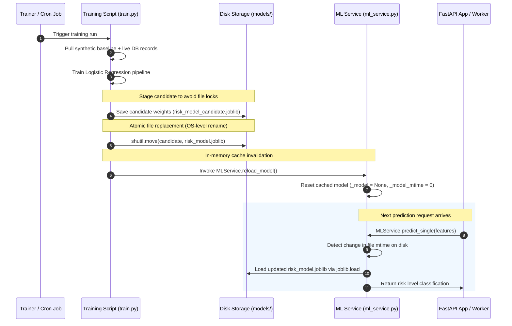
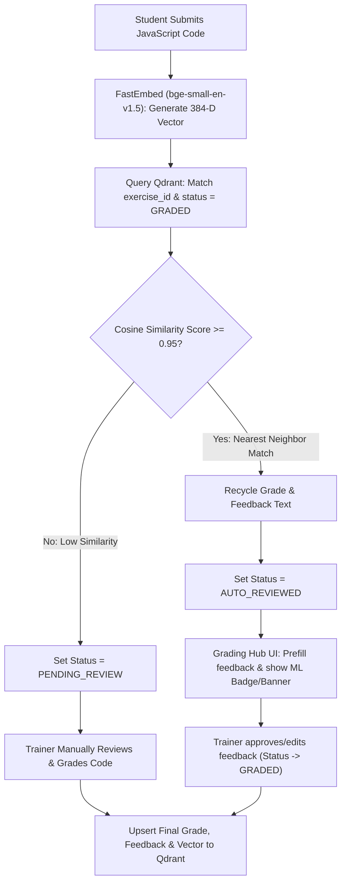

# JS-Mentor Machine Learning Engine Reference

The Machine Learning (ML) Engine in JS-Mentor provides automated, early-intervention risk assessments for students. By continually analyzing behavior, progression velocity, quiz outcomes, and practical exercises, the platform proactively identifies "High-Risk" students who may need additional support.

---

## 1. Core Architecture & Algorithms
The ML Engine utilizes a supervised classification workflow:
* **Model Classifier**: **Logistic Regression** (LBFGS solver) optimized via a regularized pipeline.
* **Preprocessing**: All numerical attributes are dynamically normalized using a **StandardScaler** to ensure uniform coefficient scale sensitivity.
* **Target Classes**: `LOW`, `MEDIUM`, and `HIGH` risk classifications.
* **Serialization**: The trained model pipeline is saved as `risk_model.joblib`.

---

## 2. Feature Engineering & Vector Representation
The ML model calculates real-time metrics across six primary features to evaluate a student's risk profile:

| Feature Name | Type | Description |
| --- | --- | --- |
| `exercise_is_correct_ratio` | Float | The ratio of correctly solved coding exercises (successful runs vs total attempts). |
| `exercise_completion_velocity` | Float | Gaps between topic progression in seconds. Extremely short gaps (< 10 seconds) flag potential copy-paste cheating patterns. |
| `practice_problems_solved` | Integer | Total problems solved in the Practice Hub, representing self-motivated practice. |
| `quiz_score` | Float | Average score obtained across curriculum module quizzes (0 to 100). |
| `avg_exercise_attempts` | Float | Average attempts required by the student to pass coding exercises. |
| `avg_exercise_execution_time_ms`| Integer | Average runtime duration of user-submitted JavaScript code. |

---

## 3. Explainable AI: Linear Factor Attribution Layer
To avoid "black-box" predictions, the engine uses a fast, local feature weight attribution layer. This layer maps the student's metrics back to the classifier coefficients to output clear, human-readable risk factors on the trainer dashboard:
* **Abnormal Velocity**: Flags copy-paste patterns if progression velocity is $< 10$ seconds.
* **Low Coding Accuracy**: Flags if correctness ratio is $< 50\%$.
* **Low Practice Hub Usage**: Flags if practice problem count is $< 5$.
* **Low Quiz Score**: Flags if average quiz score is $< 60\%$.
* **High Retry Count**: Flags if attempts average exceeds $3.0$.

---

## 4. Ingestion & Continuous Training Loop
The training script (`app/ml/train.py`) combines:
1. **Synthetic Base Data** (`synthetic_training_data.csv`): Rebalanced baseline records representing diverse failure and success patterns.
2. **Real Database Interactions**: Extracted on-the-fly from active database tables (`student_progress`, `exercise_evaluations`, `quiz_evaluations`, and `practice_progress`) to adapt the model to real-world cohorts.

### Evaluation Metrics
During training, the pipeline is evaluated across:
* **Accuracy**: Overall classification correctness.
* **Mean Squared Error (MSE)** & **Root Mean Squared Error (RMSE)**: Evaluated on ordinal risk labels (`LOW` = 0, `MEDIUM` = 1, `HIGH` = 2).
* **Custom Classification Report**: Tracks precision, recall, and support across all target classes.

## 5. Atomic Hot-Swapping & Zero-Downtime Pipeline
To guarantee continuous operations and avoid file-lock or serialization conflicts on a live production FastAPI server during active student sessions, model updates use a zero-downtime atomic pipeline:

1. **Stage to Candidate**: The training runner writes the updated Logistic Regression pipeline to a candidate file: `risk_model_candidate.joblib`.
2. **Atomic OS-level Move**: The runner calls Python's `shutil.move()` to atomically rename `risk_model_candidate.joblib` to `risk_model.joblib`. This OS-level operation ensures the target file is either fully replaced or untouched, eliminating partial or corrupted reads.
3. **In-Memory Cache Invalidation**: The runner invokes `MLService.reload_model()`, which clears the in-memory cached model instance (`_model = None` and resetting `_model_mtime = 0`).
4. **Dynamic On-Demand Reload**: The next student prediction query detects the change in file modification time (`mtime`) on disk, reload-triggers `joblib.load()`, and populates the cache with the new weights under $< 50$ milliseconds.

### Zero-Downtime Hot-Swapping Sequence Flow:



---

## 6. Vector Similarity Search & Automated Review Recycling (Qdrant + FastEmbed)
To automate the grading of programming exercises and optimize trainer efficiency, JS-Mentor integrates an on-the-fly vector similarity search (Nearest Neighbor query) engine.

### System Architecture & Pipeline
1. **Embedding Generation**: When a student submits a coding solution, the backend leverages **FastEmbed** (`BAAI/bge-small-en-v1.5` model) to generate a 384-dimensional vector embedding representing the semantic structure of the JavaScript code.
2. **Qdrant Vector Database Search**: The backend queries Qdrant to find the nearest graded historical submission for that specific `exercise_id` using **Cosine Similarity**.
3. **Similarity Threshold Match**:
    * **Score $\ge 0.95$**: If a historically graded submission matches with $\ge 95\%$ similarity, the system recycles the previous trainer's score and feedback, automatically setting the submission status to `AUTO_REVIEWED`.
   * **Score $< 0.95$**: If no matching neighbor is found within the threshold, the submission is categorized as `PENDING_REVIEW` for manual trainer grading.
4. **Attribution Library Enrichment**: When a trainer manually reviews a submission and hits "Submit Grade", the final grade, feedback, and 384-dimensional vector are upserted into Qdrant to enrich the model vector library for future students.

### Frontend UI Integration (Grading Hub)
When a submission is flagged as `AUTO_REVIEWED`, the React frontend client reacts dynamically in the **Grading Hub**:
* **Visual Badge**: The student's submission card is decorated with an "Auto-Reviewed" badge/banner.
* **Pre-filled Feedback**: The review editor text area automatically imports the recycled feedback comments, letting the trainer approve or edit them with a single click.

### Automated Code Review Pipeline Flow:



---

## 7. Bidirectional Quiz Payload Obfuscation (`quiz-prefetch`)
To secure the integrity of the interactive multiple-choice quizzes, the system intercepts network traffic inspection by obfuscating all data passed to and from the `quiz-prefetch` AI endpoints.

### The Security Challenge
By default, standard POST payloads are visible in the browser's **Network tab (Request Payload)**. This allows students to open DevTools, read the request payload, and extract the `"correct_answer"` value before selecting an option in the UI.

### The Symmetric XOR-Base64 Encryption Solution
We implemented a lightweight, zero-latency encoding system:
1. **Frontend Request Encrypt**: The React client wraps the query (`question`, `options`, `correct_answer`), converts it to a JSON string, applies a byte-wise XOR mask salted with the environment secret `REACT_APP_QUIZ_SECRET_KEY`, and encodes the result into a Base64 string. The request is dispatched as:
   ```json
   { "encoded": "U1VfVVN..." }
   ```
2. **Backend Request Decrypt**: The FastAPI endpoint receives the query, decodes the Base64 payload, applies the same XOR operation using the server's `QUIZ_SECRET_KEY`, and parses the JSON back into the query object.
3. **Backend Response Encrypt**: After generating the explanation from the AI, the backend encrypts the `{ "correct": "...", "incorrect": "..." }` response payload using the same XOR-Base64 masking method.
4. **Frontend Response Decrypt**: The React client decodes and unmasks the payload, displaying the explanation contextually.

This bidirectional obfuscation prevents student users from inspecting options or correct answers in both the Request and Response tabs.

