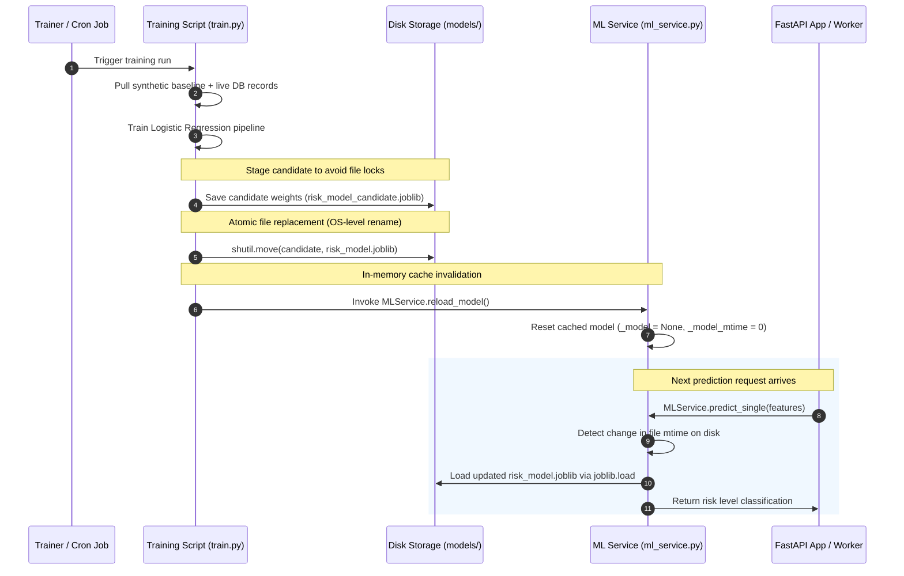
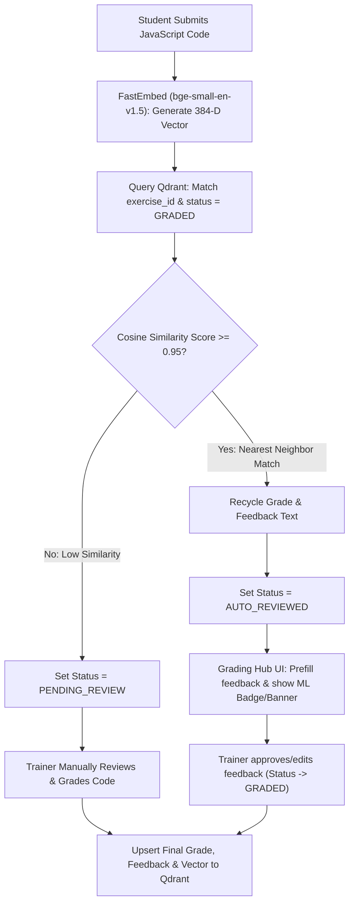

# JS-Mentor Machine Learning Engine Reference

The Machine Learning (ML) Engine in JS-Mentor provides automated, early-intervention risk assessments for students. By continually analyzing behavior, progression velocity, quiz outcomes, and practical exercises, the platform proactively identifies "High-Risk" students who may need additional support.

---

## 1. Core Architecture & Algorithms
The ML Engine utilizes a supervised classification workflow:
* **Model Classifier**: **Logistic Regression** (LBFGS solver) optimized via a regularized pipeline.
* **Preprocessing**: All numerical attributes are dynamically normalized using a **StandardScaler** to ensure uniform coefficient scale sensitivity.
* **Target Classes**: `LOW`, `MEDIUM`, and `HIGH` risk classifications.
* **Serialization**: The trained model pipeline is saved as `risk_model.joblib`.

---

## 2. Feature Engineering & Vector Representation
The ML model calculates real-time metrics across six primary features to evaluate a student's risk profile. To ensure academic integrity, the feature weights are balanced so that **tamper-proof practical coding exercise metrics from our compiler sandbox** dominate predictions over theoretical quiz scores:

| Rank | Feature Name | Type | Description |
| :---: | :--- | :--- | :--- |
| **#1** | `exercise_is_correct_ratio` | Float | The ratio of correctly solved coding exercises (successful runs vs total attempts). |
| **#2** | `exercise_completion_velocity` | Float | Gaps between topic progression in seconds. Extremely short gaps (< 10 seconds) flag potential copy-paste cheating patterns. |
| **#3** | `practice_problems_solved` | Integer | Total problems solved in the Practice Hub, representing self-motivated practice. |
| **#4** | `quiz_score` | Float | Average score obtained across curriculum module quizzes (0 to 100). |
| **#5** | `avg_exercise_attempts` | Float | Average attempts required by the student to pass coding exercises. |
| **#6** | `avg_exercise_execution_time_ms`| Integer | Average runtime duration of user-submitted JavaScript code. |

*Note: `curriculum_exercise_coverage_ratio` was excluded at this stage because only Learning Paths 1 and 2 are active in the live curriculum.*

---

## 3. Model Selection & Benchmarking
The choice of model was validated through a comparative analysis against alternative ensemble and sequence-based architectures.

### Nature of Data
Our system database triggers compile student interactions into **2D cross-sectional tabular summary vectors ($N \text{ students} \times F \text{ features}$)** rather than raw, chronological, millisecond-by-millisecond time-series events. Because the rows are independent of one another (shuffling the student records has zero impact on the dataset's meaning), the data is natively cross-sectional/tabular.

### Comparative Evaluation
To evaluate feasibility under deployment constraints, we benchmarked a recurrent neural network (RNN) baseline model (created by reshaping our tabular features into pseudo-sequence tensors of shape $(N \times T=1 \times F=6)$) alongside Random Forest and XGBoost Classifiers. Complete code, training loops, and evaluation metrics are hosted in our project's Jupyter/Kaggle Notebooks.

| Model | Accuracy (%) | MSE | RMSE | RAM Footprint | Explainability / Dashboards | Selected? |
| :--- | :---: | :---: | :---: | :---: | :---: | :---: |
| **Logistic Regression** | **86.2%** | **0.261** | **0.5109** | **~35 MB** | **100% (Instant Local Coefficients)** | **YES** |
| **Random Forest** | 83.8% | 0.192 | 0.4382 | ~50 MB | Partial (Global Importance Only) | No |
| **XGBoost Classifier** | 88.3% | 0.120 | 0.3464 | ~60 MB | Partial (Global Importance Only) | No |
| **RNN (PyTorch)** | 98.4% | 0.0160 | 0.1265 | 400+ MB | Black-Box (No Interpretability) | No |

### Architectural Selection Justification
While the RNN model achieves a high accuracy of 98.4%, it was rejected for the following reasons:
1. **The Overfitting Trap:** Deep learning models with massive parameter counts (like RNNs) are highly prone to overfitting on static tabular data. The 98.4% accuracy (with near-zero MSE) indicates the model is memorizing the training dataset, which would fail to generalize on unseen real-world cohort data.
2. **Loss of Sequence Benefits:** Because sequence length $T=1$, there is no sequence path, collapsing the recurrent temporal modeling advantages of the RNN and turning it into a heavy feedforward wrapper.
3. **Severe Resource Constraints:** PyTorch startup memory usage exceeds **400+ MB of RAM**, triggering immediate Out-Of-Memory (OOM) crashes on our server environment (Render Free Tier, strict **512 MB RAM limit**). Scikit-learn's Logistic Regression consumes only **~35 MB**, leaving ample headroom for concurrent WebSocket traffic.
4. **Explainability Requirement:** The Trainer Dashboard requires local feature weight attributions to display actionable insights (e.g., explaining why a student is flagged). The RNN functions as a black box, whereas Logistic Regression provides 100% white-box mathematical coefficients.

---

## 4. Explainable AI: Linear Factor Attribution Layer
To avoid "black-box" predictions, the engine uses a fast, local feature weight attribution layer. This layer maps the student's metrics back to the classifier coefficients to output clear, human-readable risk factors on the trainer dashboard:
* **Abnormal Velocity**: Flags copy-paste patterns if progression velocity is $< 10$ seconds.
* **Low Coding Accuracy**: Flags if correctness ratio is $< 50\%$.
* **Low Practice Hub Usage**: Flags if practice problem count is $< 5$.
* **Low Quiz Score**: Flags if average quiz score is $< 60\%$.
* **High Retry Count**: Flags if attempts average exceeds $3.0$.

---

## 5. Ingestion & Generative Data Modeling
The training script (`app/ml/train.py`) combines:
1. **Synthetic Base Data** (`synthetic_training_data.csv`): Rebalanced baseline records representing diverse failure and success patterns.
2. **Real Database Interactions**: Extracted on-the-fly from active database tables (`student_progress`, `exercise_evaluations`, `quiz_evaluations`, and `practice_progress`) to adapt the model to real-world cohorts.

### Mathematical Data Generator (`generate_local_data.py`)
To bootstrap training, we utilize a mathematical data generator that assigns a normally-distributed aptitude score to simulated students and derives performance features based on this aptitude, establishing realistic correlation rules.

Below is the complete script used to generate our correlated training dataset:

```python
import csv
import random
import math

# Sigmoid function
def sigmoid(x):
    return 1 / (1 + math.exp(-x))

def generate_realistic_data(num_rows=5000):
    output_file = "synthetic_training_data.csv"
    headers = [
        "student_id",
        "exercise_is_correct_ratio",
        "exercise_completion_velocity",
        "practice_problems_solved",
        "quiz_score",
        "avg_exercise_attempts",
        "avg_exercise_execution_time_ms",
        "predicted_pass_probability",
        "risk_level"
    ]
    
    with open(output_file, mode='w', newline='') as file:
        writer = csv.writer(file)
        writer.writerow(headers)
        
        for i in range(1, num_rows + 1):
            # Generate independent normalized features in [0, 1] to prevent collinearity suppression
            correct_norm = random.uniform(0.0, 1.0)
            velocity_norm = random.uniform(0.0, 1.0)
            practice_norm = random.uniform(0.0, 1.0)
            quiz_norm = random.uniform(0.0, 1.0)
            attempts_norm = random.uniform(0.0, 1.0)
            exec_time_norm = random.uniform(0.0, 1.0)

            # Simulate a 5% copy-paste cheating group (instant submissions < 10 seconds)
            is_cheating = random.random() < 0.05
            if is_cheating:
                exercise_is_correct_ratio = round(random.uniform(0.85, 1.0), 2)
                exercise_completion_velocity = round(random.uniform(1.0, 5.0), 1)
                practice_problems_solved = int(random.uniform(10, 50))
                quiz_score = round(random.uniform(90.0, 100.0), 1)
                correct_norm = exercise_is_correct_ratio
                velocity_norm = 0.0
                practice_norm = practice_problems_solved / 100.0
                quiz_norm = quiz_score / 100.0
            else:
                exercise_is_correct_ratio = round(correct_norm, 2)
                exercise_completion_velocity = round(velocity_norm * 600.0 + 30.0, 1)
                practice_problems_solved = int(practice_norm * 100)
                quiz_score = round(quiz_norm * 100.0, 1)

            avg_exercise_attempts = round(attempts_norm * 9.0 + 1.0, 1)
            avg_exercise_execution_time_ms = int(exec_time_norm * 9500 + 500)

            # Calculate Target Variable Z with strict weight hierarchy Rank #1 to #6
            z = -5.5  # Intercept to balance LOW/MEDIUM/HIGH classes
            z += (correct_norm * 6.5)
            z += (velocity_norm * 3.8)
            z += (practice_norm * 2.8)
            z += (quiz_norm * 1.8)
            z -= (attempts_norm * 1.0)
            z -= (exec_time_norm * 0.4)

            if exercise_completion_velocity < 10.0:
                z -= 10.0  # Heavy anti-cheat penalty for copy-pasting

            predicted_pass_probability = round(sigmoid(z), 3)

            if predicted_pass_probability >= 0.70:
                risk_level = "LOW"
            elif predicted_pass_probability <= 0.40:
                risk_level = "HIGH"
            else:
                risk_level = "MEDIUM"

            writer.writerow([
                i,
                exercise_is_correct_ratio,
                exercise_completion_velocity,
                practice_problems_solved,
                quiz_score,
                avg_exercise_attempts,
                avg_exercise_execution_time_ms,
                predicted_pass_probability,
                risk_level
            ])
            
    print(f"Successfully generated {num_rows} rows of algorithmically correlated data!")
    print(f"Saved to {output_file}")

if __name__ == "__main__":
    generate_realistic_data(5000)
```

---

## 6. Atomic Hot-Swapping & Zero-Downtime Pipeline
To guarantee continuous operations and avoid file-lock or serialization conflicts on a live production FastAPI server during active student sessions, model updates use a zero-downtime atomic pipeline:

1. **Stage to Candidate**: The training runner writes the updated Logistic Regression pipeline to a candidate file: `risk_model_candidate.joblib`.
2. **Atomic OS-level Move**: The runner calls Python's `shutil.move()` to atomically rename `risk_model_candidate.joblib` to `risk_model.joblib`. This OS-level operation ensures the target file is either fully replaced or untouched, eliminating partial or corrupted reads.
3. **In-Memory Cache Invalidation**: The runner invokes `MLService.reload_model()`, which clears the in-memory cached model instance (`_model = None` and resetting `_model_mtime = 0`).
4. **Dynamic On-Demand Reload**: The next student prediction query detects the change in file modification time (`mtime`) on disk, reload-triggers `joblib.load()`, and populates the cache with the new weights under $< 50$ milliseconds.

### Zero-Downtime Hot-Swapping Sequence Flow:



---

## 7. Vector Similarity Search & Automated Review Recycling (Qdrant + FastEmbed)
To automate the grading of programming exercises and optimize trainer efficiency, JS-Mentor integrates an on-the-fly vector similarity search (Nearest Neighbor query) engine.

### System Architecture & Pipeline
1. **Embedding Generation**: When a student submits a coding solution, the backend leverages **FastEmbed** (`BAAI/bge-small-en-v1.5` model) to generate a 384-dimensional vector embedding representing the semantic structure of the JavaScript code.
2. **Qdrant Vector Database Search**: The backend queries Qdrant to find the nearest graded historical submission for that specific `exercise_id` using **Cosine Similarity**.
3. **Similarity Threshold Match**:
    * **Score $\ge 0.95$**: If a historically graded submission matches with $\ge 95\%$ similarity, the system recycles the previous trainer's score and feedback, automatically setting the submission status to `AUTO_REVIEWED`.
    * **Score $< 0.95$**: If no matching neighbor is found within the threshold, the submission is categorized as `PENDING_REVIEW` for manual trainer grading.
4. **Attribution Library Enrichment**: When a trainer manually reviews a submission and hits "Submit Grade", the final grade, feedback, and 384-dimensional vector are upserted into Qdrant to enrich the model vector library for future students.

### Frontend UI Integration (Grading Hub)
When a submission is flagged as `AUTO_REVIEWED`, the React frontend client reacts dynamically in the **Grading Hub**:
* **Visual Badge**: The student's submission card is decorated with an "Auto-Reviewed" badge/banner.
* **Pre-filled Feedback**: The review editor text area automatically imports the recycled feedback comments, letting the trainer approve or edit them with a single click.

### Automated Code Review Pipeline Flow:


