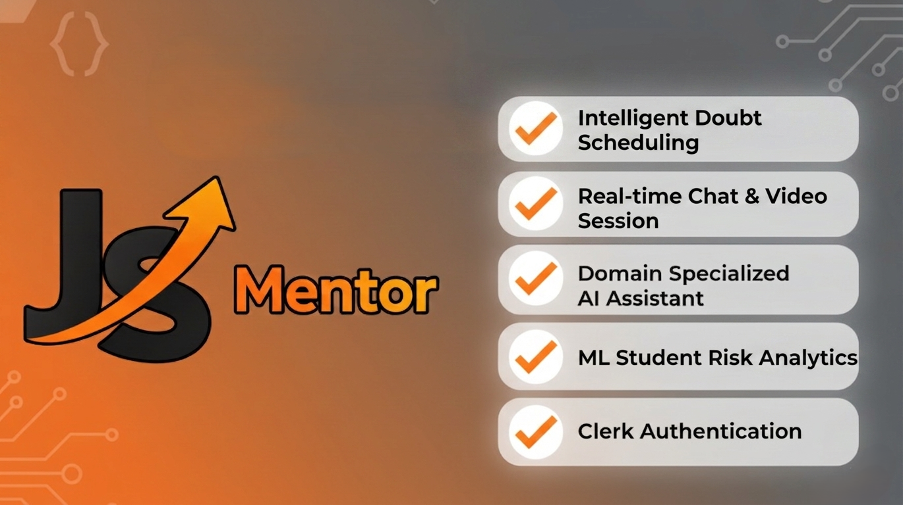
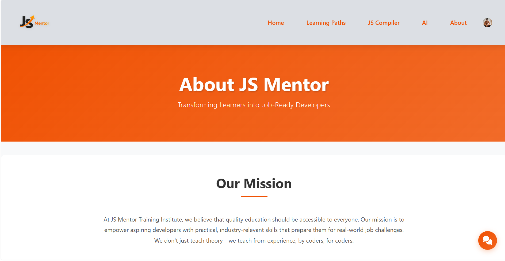
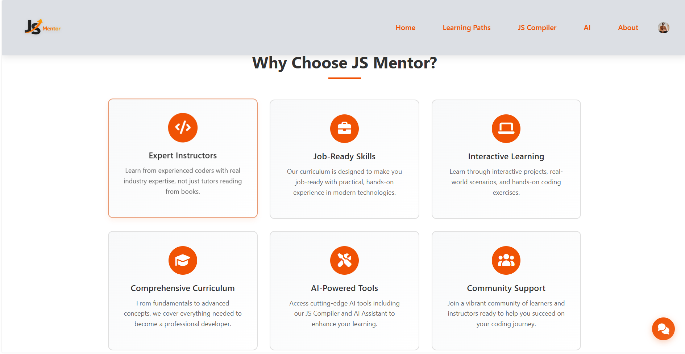
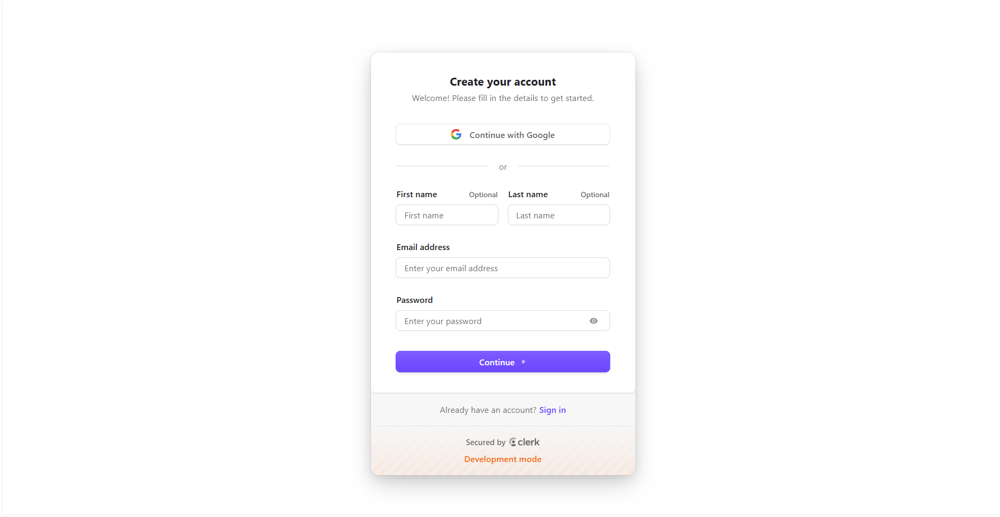
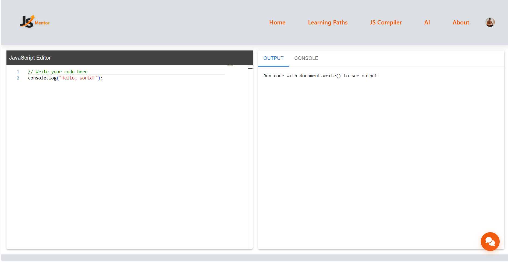
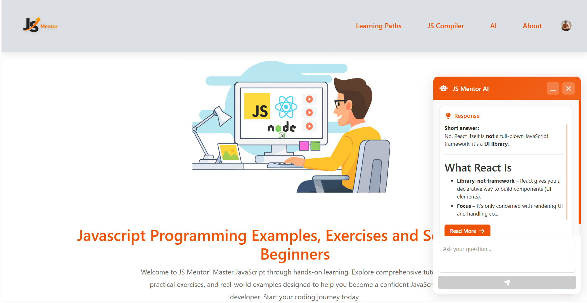

# JS Mentor

## Introduction

**JS Mentor** is a beginner-friendly learning platform and web-based LMS (Learning Management System) designed to help aspiring developers master JavaScript fundamentals through interactive lessons, real-time code execution, and AI-powered assistance. Unlike traditional collaborative coding platforms, JS Mentor focuses on guided learning, personalized feedback, and hands-on practice tailored for newcomers.

<br><br>

The platform now includes **role‑based authentication** and a **chatbot assistant**, alongside an integrated online compiler, curated challenges, and an AI helper that supports learners with contextual hints, explanations, and debugging tips. Whether you're just starting out or revisiting core concepts, JS Mentor provides a structured, supportive environment to build confidence and fluency in JavaScript development.
 
## 📸 Screenshots

**Landing Page**

<br><br>

**About Page**

<br><br>


<br><br>


<br><br>

**Login & SignUp**

<br><br>


<br><br>

**Learning Paths**

<br><br>

**JS Compiler**

<br><br>

**Domain Specialized AI Assistant**

<br><br>

<br><br>


## Usage

To use JS Mentor locally, clone the repository and follow the setup instructions below. You can explore the learning modules, test your code in the built-in compiler, and interact with the AI helper for guidance.

- Clone the repository to your local machine.
- Follow installation steps to set up dependencies.
- Explore the `/modules` directory for learning content.
- Use the online compiler to run and test code.
- Engage with the AI helper for explanations and debugging.

## Features

JS Mentor offers a rich set of features to support beginner developers:

- Interactive JavaScript lessons and challenges with progressive difficulty.
- Built-in **online compiler** for instant code execution.
- **Domain Specialized AI Assistant**:
  - Focused exclusively on JavaScript questions.
  - **AI Error Explanation:** A context-aware "Explain Error" system that detects runtime failures and uses the Groq API to provide friendly, plain-language explanations.
- **Chatbot integration** for quick acccess to help and interactive Q&A.
- Modular structure for scalable content delivery.
- Responsive UI optimized for desktop and mobile.

## Configuration

The repository supports customization for different learning workflows:

- Environment variables can be set via a `.env` file for local development.
- Lesson parameters and challenge configurations are stored in the `/config` directory.
- Clerk publishable key must be set for authentication.
- Linting and formatting rules are defined in root-level config files.
- GitHub Actions are available for automated testing and deployment.
- User preferences can be managed through local configuration files.

### Example `.env` file

```env
COMPILER_TIMEOUT=30
ENABLE_AI_HELPER=true
API_KEY=your_api_key_here
```

## Requirements

Before installing and running **JS Mentor**, make sure your environment meets the following prerequisites:

### Core Requirements
- **Node.js**: Version 16 or higher (recommended for modern JavaScript features and stability).
- **npm** (comes with Node.js) or **Yarn**: Latest version recommended for package management.
- **Git**: For cloning the repository and version control.
- **Code Editor**: A modern editor such as [Visual Studio Code](https://code.visualstudio.com/) for best developer experience.

### Optional / Advanced Tools
- **Docker**: Useful if you want to run JS Mentor inside a containerized environment.
- **Database**: PostgreSQL or MongoDB, if you plan to enable persistent storage or advanced LMS features.
- **Python**: Required only if you intend to run certain challenge scripts or integrations.
- **CI/CD Tools**: GitHub Actions or other pipelines for automated testing and deployment.

### Recommended Setup
- A stable internet connection (for AI helper and online compiler features).
- Browser: Latest version of Chrome, Firefox, or Edge for optimal performance.

## Installation

Follow these steps to install and set up Coding-Sharks:

1. **Clone the repository:**

   ```bash
   git clone https://github.com/suyash-rgb/JS-Mentor.git
   ```

2. **Install dependencies:**

   ```bash
   npm install
   ```

   Or, if using yarn:

   ```bash
   yarn install
   ```

3. **Set up environment variables:**

   Copy the example environment file and edit as needed:

   ```bash
   cp .env.example .env
   ```

4. **Run initial setup scripts:**

   ```bash
   npm run setup
   ```

5. **Start the development server:**

   ```bash
   npm start
   ```

---

For more details, refer to the inline documentation and code comments throughout the repository. Happy coding!
