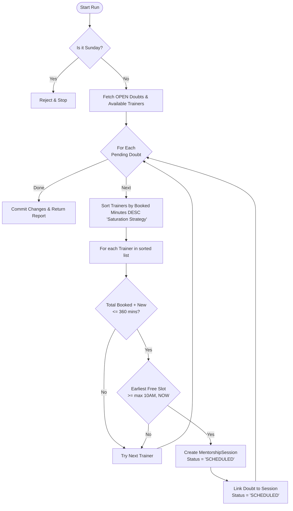
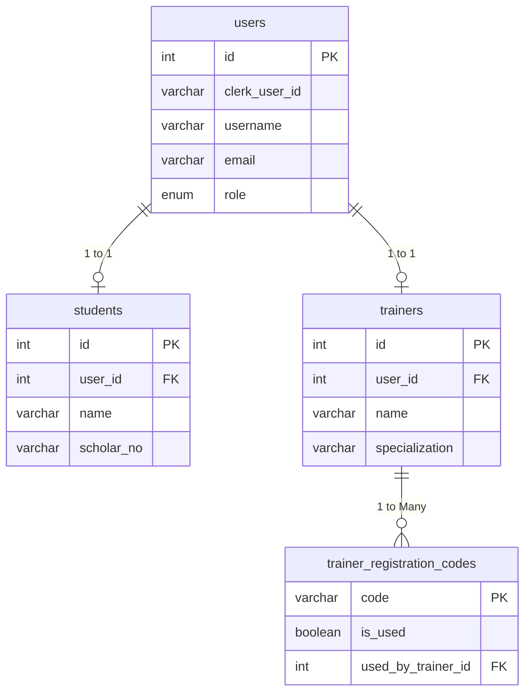
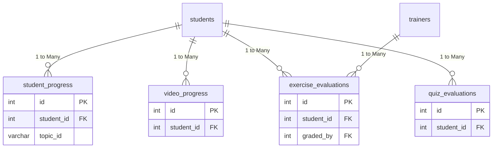
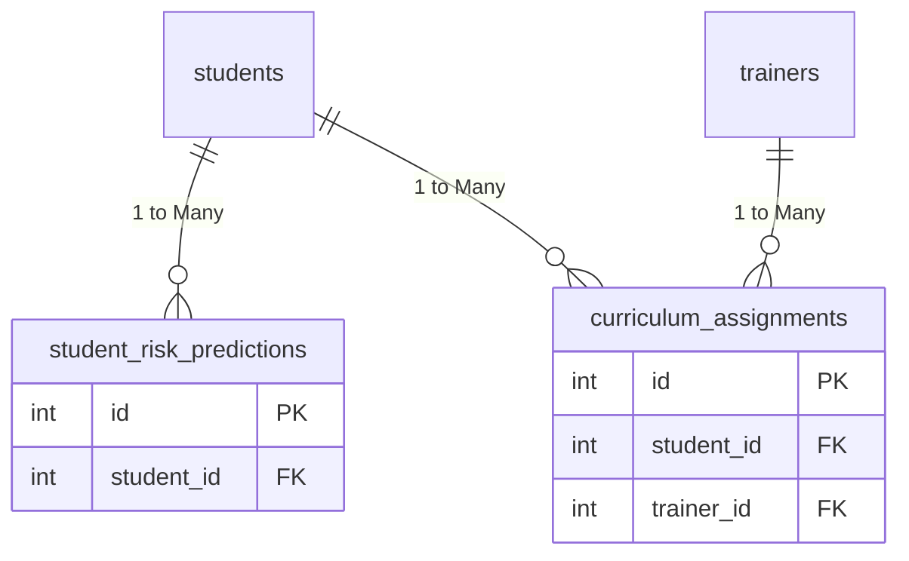
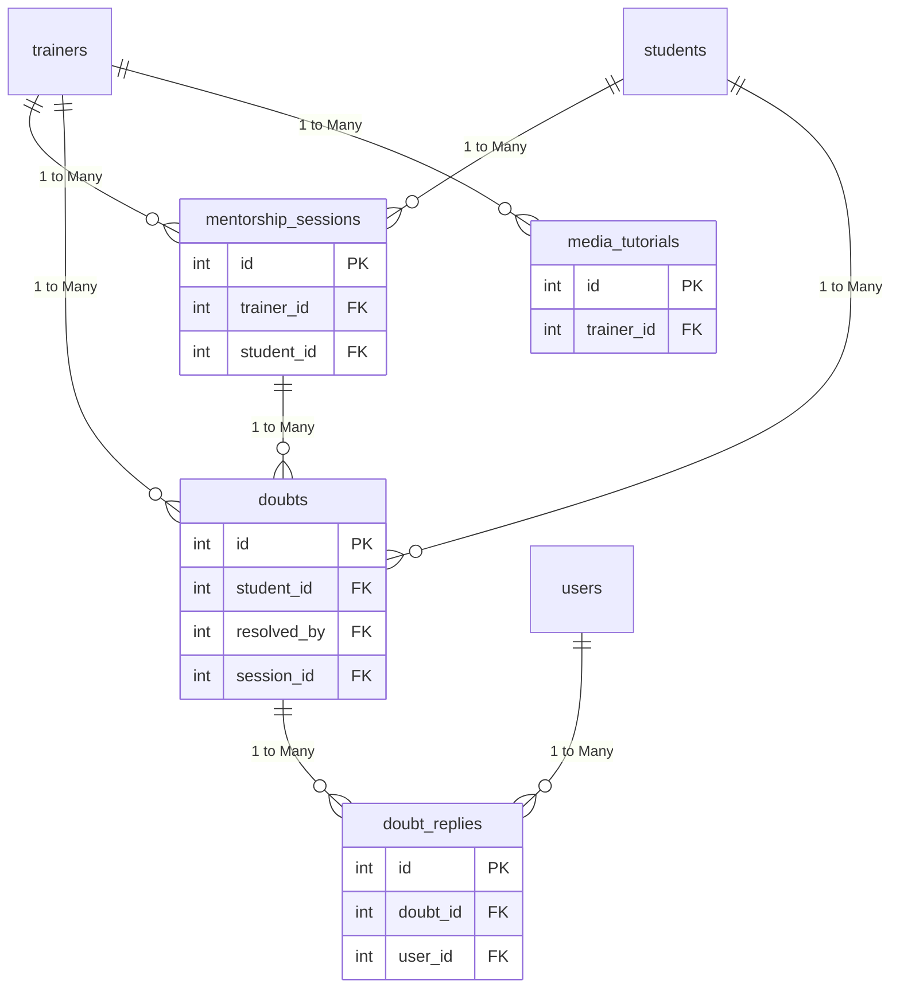
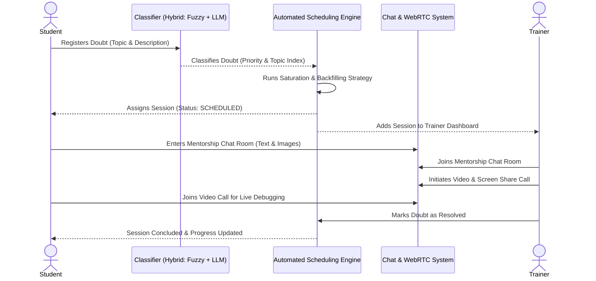
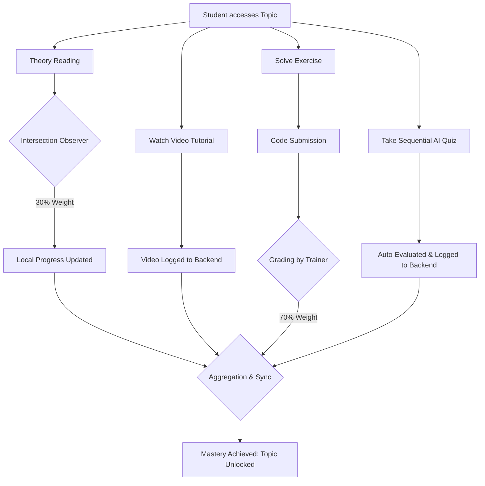
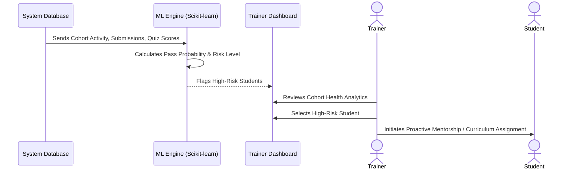

# JS-Mentor: The Ultimate AI-Powered JavaScript LMS

JS-Mentor is a state-of-the-art, feature-rich Learning Management System (LMS) specifically engineered for mastering JavaScript. It merges interactive curriculum delivery with cutting-edge AI assistance, real-time mentorship tools, and machine-learning-driven student analytics to create a holistic learning ecosystem.

---

## Contents

- [Key Pillars of the Platform](#key-pillars-of-the-platform)
- [Technical Stack](#technical-stack)
- [Technical Deep Dives](#technical-deep-dives)
- [Database ER Diagram](#database-er-diagram)
- [Data Dictionary](#data-dictionary)
- [Getting Started](#getting-started)
- [Project Roadmap](#project-roadmap)
- [Contribution & Governance](#contribution--governance)

---

## Key Pillars of the Platform

### 1. AI-Driven Learning Experience
*   **Domain-Specialized AI Assistant**: A dedicated JavaScript mentor available 24/7, providing context-aware guidance without giving away direct answers.
*   **AI Error Explanation**: Integrated with the online compiler, this feature detects runtime failures and uses the Groq API to provide friendly, plain-language explanations of complex errors.
*   **Sequential AI Quizzes**: Intelligent assessment paths that adapt to student performance, ensuring foundational concepts are mastered before advancing.
*   **Smart Chatbot**: A persistent, sleek UI component for quick Q&A, featuring markdown support, code highlighting, and seamless redirection to deep-dive AI pages.

### 2. Real-time Mentorship & Collaboration
*   **1-on-1 Video & Screen Sharing**: Built on PeerJS, allowing trainers to initiate instant high-quality video calls and screen-sharing sessions directly within the browser.
*   **Unified Mentorship Chat**: A robust WebSocket-based messaging system (powered by RabbitMQ on the backend) for seamless student-trainer communication.
*   **Automated Scheduling Engine**: A sophisticated backend engine that manages doubt sessions using a **Saturation Strategy**. It prioritizes trainer efficiency and supports dynamic backfilling for resolved or cancelled slots.

### 3. Trainer Dashboard & Analytics
*   **Cohort Health Analytics**: Real-time visualization of student progress, completion rates, and engagement metrics across different learning paths.
*   **ML-Powered Risk Assessment**: Uses machine learning to predict "High-Risk" students based on their activity patterns, submission delays, and quiz scores.
*   **Grading Hub**: A centralized interface for trainers to review, grade, and provide feedback on coding exercises.

### 4. Advanced Content Management
*   **Visual Quiz Builder (XYFlow)**: A node-based, interactive builder for creating complex, branching assessment paths visually.
*   **Dynamic Learning Paths**: Support for atomic theory reading and exercise-based competency tracking.
*   **Media Manager**: Integrated Cloudinary support for ephemeral image uploads and self-cleaning media management. Supports both YouTube and local video tutorials.

---

## Technical Stack

### Frontend (The Experience)
- **Framework**: React.js
- **Authentication**: Clerk (Role-based: Student/Trainer/Institute)
- **State Management**: Context API with persistent local storage
- **Visualization**: XYFlow (Quiz Logic), Chart.js (Analytics)
- **Communication**: PeerJS (WebRTC), Socket.io-client
- **Styling**: Modern, responsive UI with custom CSS (Glassmorphism, Vibrant Accents, and Light/Dark Mode support)

### Backend (The Engine)
- **API Framework**: FastAPI (Python)
- **Database**: PostgreSQL (Production) / SQLite (Dev)
- **Scheduling**: Custom Python-based logic engine with FIFO and Saturation strategies
- **ML Engine**: Scikit-learn for student risk prediction models
- **Deployment**: Dockerized services for scalable delivery

---

## Technical Deep Dives

### Strict Progress Tracking Logic (Synced & Weighted)
The system evaluates page "Mastery" and strictly synchronizes it with the backend database to prevent bypassing of learning paths:
- **Theory Reading (30%)**: Tracked locally via `IntersectionObserver` as students consume content.
- **Exercise Mastery (70%)**: Calculated by the ratio of successfully completed coding challenges on the page.
- **Server-Synced Valuations**: Progress is further secured by logging **Video Completions** and verifying **Quiz Evals & Exercise Evals** directly against backend evaluations to generate a true `topicStatus`.
*This hybrid approach ensures students cannot "complete" a technical topic without hands-on verified practice.*

### Doubt Session Scheduling Logic

The JS-Mentor Doubt Scheduling Engine is designed to maximize trainer efficiency through a **Saturation & Dynamic Backfilling** strategy.

#### ── Business Rules ──

1.  **Availability**: No doubt sessions are scheduled on **Sundays**.
2.  **Trainer Shifts**: The active window is **10:00 AM – 4:00 PM** (6 hours/day).
3.  **Durations**:
    *   Learning Paths 1 & 2 → **30-minute** sessions.
    *   Learning Paths 3 – 6 → **60-minute** sessions.
4.  **Priority**: Doubts are processed **FIFO** (oldest request first).
5.  **Saturation Strategy**: The engine fills one trainer's schedule completely before assigning tasks to the next available trainer.
6.  **Dynamic Backfilling**: If a session is resolved early or a trainer goes online mid-day, the engine can "tap into" the current time to fill newly available gaps.

#### ── Algorithmic Flow ──



#### ── Optimization Details ──

**1. Saturation Sorting**
Instead of spreading the load (Load Balancing), we sort trainers by their already booked minutes in **descending** order. This ensures that the engine tries to "top up" the trainer who is already working, keeping other trainers free unless necessary.

**2. Dynamic "Now" Floor**
When searching for an available slot (`_next_free_slot`), the engine uses `max(SESSION_START, CURRENT_TIME)`. This allows for **immediate scheduling** of new doubts into the current day's gaps, rather than waiting for the next day.

**3. Reactive Triggers**
The engine doesn't just run on a schedule. It is reactively triggered when:
*   A **Student** registers a new doubt.
*   A **Trainer** marks a session as resolved (freeing up their remaining time).

---

## Database ER Diagrams

To improve visibility, the database schema is divided into three core domains:

### 1. Core Profiles & Authentication



### 2.1 Evaluation & Progress



### 2.2 Curriculum & Risk Predictions



### 3. Mentorship & Interaction



---

## Data Dictionary

### Table Overviews

| Table Name | Description | Related Tables |
| :--- | :--- | :--- |
| **`users`** | Core authentication profiles mapping Clerk credentials to platform roles. | `students`, `trainers`, `doubt_replies` |
| **`students`** | Specific profiles for students containing academic details like scholar numbers. | `users`, `student_progress`, `exercise_evaluations`, `quiz_evaluations`, `student_risk_predictions`, `mentorship_sessions`, `doubts`, `curriculum_assignments`, `video_progress` |
| **`trainers`** | Specific profiles for trainers containing their specialized areas. | `users`, `trainer_registration_codes`, `exercise_evaluations`, `mentorship_sessions`, `doubts`, `curriculum_assignments`, `media_tutorials` |
| **`trainer_registration_codes`** | Pre-authorized codes used by trainers to register onto the platform. | `trainers` |
| **`student_progress`** | Tracks student progress and time spent across various learning paths/topics. | `students` |
| **`exercise_evaluations`** | Records student coding submissions, attempts, and grades provided by trainers. | `students`, `trainers` |
| **`quiz_evaluations`** | Logs student scores, attempts, and pass/fail statuses for visual quizzes. | `students` |
| **`student_risk_predictions`** | Stores machine-learning driven risk assessments and probability of student failure. | `students` |
| **`mentorship_sessions`** | Manages scheduled and active 1-on-1 sessions between trainers and students. | `trainers`, `students`, `doubts` |
| **`doubts`** | Represents individual queries or issues raised by students waiting for resolution. | `students`, `trainers`, `mentorship_sessions`, `doubt_replies` |
| **`doubt_replies`** | Chat messages and replies within a specific doubt thread. | `doubts`, `users` |
| **`curriculum_assignments`** | Links specific learning paths assigned to students by trainers with due dates. | `trainers`, `students` |
| **`media_tutorials`** | References external media tutorials (e.g., videos) uploaded or linked by trainers. | `trainers` |
| **`video_progress`** | Tracks the completion status and watched seconds for individual student video access. | `students` |

---

## Key User Workflows & Scenarios

### 1. Doubt Lifecycle & Resolution
This scenario illustrates the journey of a student's doubt from registration to resolution.



### 2. Curriculum Mastery & Progress Tracking
This flow demonstrates how student progress is rigorously tracked and verified against the backend database.



### 3. ML-Powered Risk Assessment & Intervention
This scenario outlines the proactive approach taken by the platform to identify and assist struggling students.



## Getting Started

### 1. Clone & Install
```bash
git clone https://github.com/suyash-rgb/JS-Mentor.git
cd JS-Mentor
npm install
```

### 2. Environment Configuration
Create a `.env` file in the root directory:
```env
REACT_APP_CLERK_PUBLISHABLE_KEY=your_clerk_key
REACT_APP_API_BASE_URL=http://localhost:8000
REACT_APP_CLOUDINARY_CLOUD_NAME=your_cloud_name
```

### 3. Start the Engines
- **Frontend**: `npm start`
- **Backend**: (Navigate to backend directory) `uvicorn app.main:app --reload`

---

## Project Roadmap 
- [x] **PeerJS Integration**: Real-time video/screen share refactor.
- [x] **Visual Quiz Visualizer**: XYFlow integration for curriculum management.
- [x] **ML Risk API**: Initial cohort status and predictive modeling.
- [x] **Cloudinary Integration**: Ephemeral image upload and self-cleaning system.
- [x] **WebSocket Signaling**: Robust real-time chat and session resolution.
- [ ] **Advanced Learning Path Inference**: Dynamic syllabus generation (In Progress).

---

## Contribution & Governance
We use a structured branching strategy:
- `main`: Production-ready, stable releases.
- `dev`: Active frontend development and integration.
- `backend`: Core API and microservices development.

For more details, refer to the inline documentation and code comments throughout the repository. For detailed API documentation, refer to the `SCHEDULER_LOGIC.md` and `trainer_dashboard_apis.md` files. Happy coding!

---
*Developed for the JavaScript Community.*
