# JS-Mentor: The Ultimate AI-Powered JavaScript LMS

JS-Mentor is a state-of-the-art, feature-rich Learning Management System (LMS) specifically engineered for mastering JavaScript. It merges interactive curriculum delivery with cutting-edge AI assistance, real-time mentorship tools, and machine-learning-driven student analytics to create a holistic learning ecosystem.

---

## Contents

- [Key Pillars of the Platform](#key-pillars-of-the-platform)
- [Key User Workflows & Scenarios](#key-user-workflows--scenarios)
- [Technical Stack](#technical-stack)
- [Database ER Diagram](#database-er-diagram)
- [Data Dictionary](#data-dictionary)
- [Getting Started](#getting-started)
- [Contribution & Governance](#contribution--governance)

---

## Key Pillars of the Platform

### 1. AI-Driven Learning Experience
*   **Domain-Specialized AI Assistant**: A dedicated JavaScript mentor available 24/7, providing context-aware guidance without giving away direct answers.
*   **AI Error Explanation**: Integrated with the online compiler, this feature detects runtime failures and uses the Groq API to provide friendly, plain-language explanations of complex errors.
*   **Smart Chatbot**: A persistent, sleek UI component for quick Q&A, featuring markdown support, code highlighting, and seamless redirection to deep-dive AI pages.

### 2. Real-time Mentorship & Collaboration
*   **1-on-1 Video & Screen Sharing**: Built on PeerJS, allowing trainers to initiate instant high-quality video calls and screen-sharing sessions directly within the browser.
*   **Unified Mentorship Chat**: A robust WebSocket-based messaging system for seamless student-trainer communication.
*   **Automated Scheduling Engine**: A sophisticated backend engine that manages doubt sessions using a **Saturation Strategy**. It prioritizes trainer efficiency and supports dynamic backfilling for resolved or cancelled slots.

### 3. Trainer Dashboard & Analytics
*   **Cohort Health Analytics**: Real-time visualization of student progress, completion rates, and engagement metrics across different learning paths.
*   **ML-Powered Risk Assessment**: Uses machine learning to predict "High-Risk" students based on their activity patterns, submission delays, and quiz scores.
*   **Grading Hub**: A centralized interface for trainers to review, grade, and provide feedback on coding exercises.

### 4. Advanced Content Management
*   **Visual Quiz Builder (XYFlow)**: A node-based, interactive builder for creating complex, branching assessment paths visually.
*   **Dynamic Learning Paths**: Support for atomic theory reading and exercise-based competency tracking.
*   **Media Manager**: Integrated Cloudinary support for ephemeral image uploads and self-cleaning media management. Supports both YouTube and local video tutorials.

---

## Key User Workflows & Scenarios

### 1. Dual Authentication & Registration Flow
This flow details how students and trainers access the platform using completely distinct authentication strategies.

#### 1.1 Student Flow
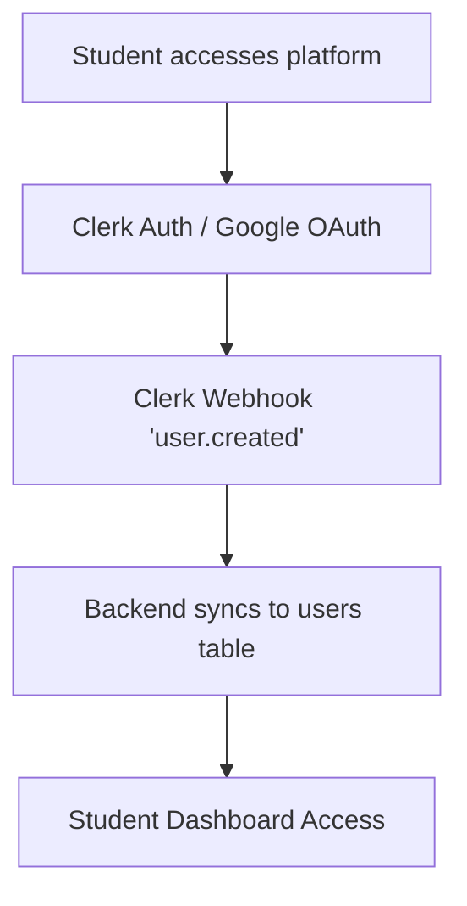

**Flow Explanation:**
When a student accesses the JS-Mentor platform, they are routed through Clerk's authentication system, typically utilizing Google OAuth for a frictionless sign-in experience. Once the student successfully authenticates, Clerk triggers a `user.created` webhook. Our backend intercepts this webhook to securely synchronize the new user's credentials into our primary database (`users` and `students` tables). This ensures the student's dashboard is fully provisioned and ready for access without any manual registration steps.

#### 1.2 Trainer Flow
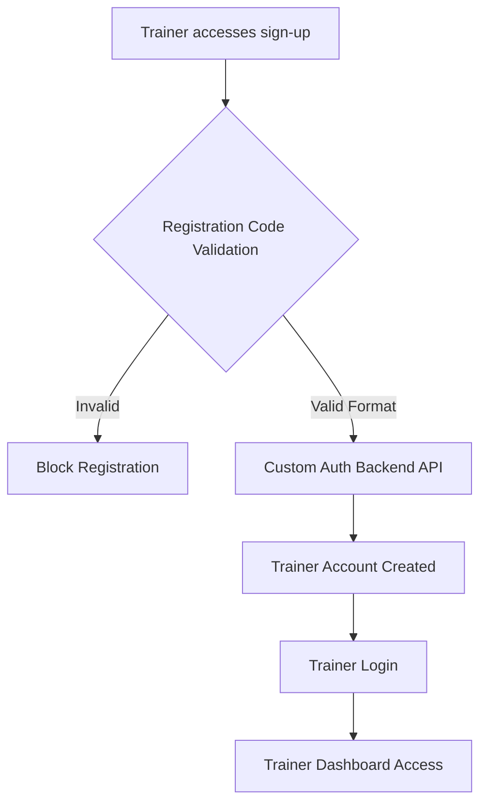

**Flow Explanation:**
The trainer onboarding process enforces strict access control. When a prospective trainer attempts to sign up, they must provide a pre-authorized Registration Code. The system validates this code format; invalid codes immediately block the registration attempt. Valid codes proceed to a custom backend authentication API which creates the specific trainer account and links the consumed code. Subsequently, the trainer can log in using their newly created credentials to access the specialized Trainer Dashboard.

### 2. Doubt Lifecycle & Resolution

#### 2.1 Doubt Scheduling Engine/Algorithm
The JS-Mentor Doubt Scheduling Engine is designed to maximize trainer efficiency through a **Saturation & Dynamic Backfilling** strategy.

##### ── Business Rules ──

1.  **Availability**: No doubt sessions are scheduled on **Sundays**.
2.  **Trainer Shifts**: The active window is **10:00 AM – 4:00 PM** (6 hours/day).
3.  **Durations**:
    *   Learning Paths 1 & 2 → **30-minute** sessions.
    *   Learning Paths 3 – 6 → **60-minute** sessions.
4.  **Priority**: Doubts are processed **FIFO** (oldest request first).
5.  **Saturation Strategy**: The engine fills one trainer's schedule completely before assigning tasks to the next available trainer.
6.  **Dynamic Backfilling**: If a session is resolved early or a trainer goes online mid-day, the engine can "tap into" the current time to fill newly available gaps.

##### ── Algorithmic Flow ──


##### ── Optimization Details ──

**1. Saturation Sorting**
Instead of spreading the load (Load Balancing), we sort trainers by their already booked minutes in **descending** order. This ensures that the engine tries to "top up" the trainer who is already working, keeping other trainers free unless necessary.

**2. Dynamic "Now" Floor**
When searching for an available slot (`_next_free_slot`), the engine uses `max(SESSION_START, CURRENT_TIME)`. This allows for **immediate scheduling** of new doubts into the current day's gaps, rather than waiting for the next day.

**3. Reactive Triggers**
The engine doesn't just run on a schedule. It is reactively triggered when:
*   A **Student** registers a new doubt.
*   A **Trainer** marks a session as resolved (freeing up their remaining time).

#### 2.2 Full Resolution Lifecycle
This scenario illustrates the journey of a student's doubt from registration to resolution.

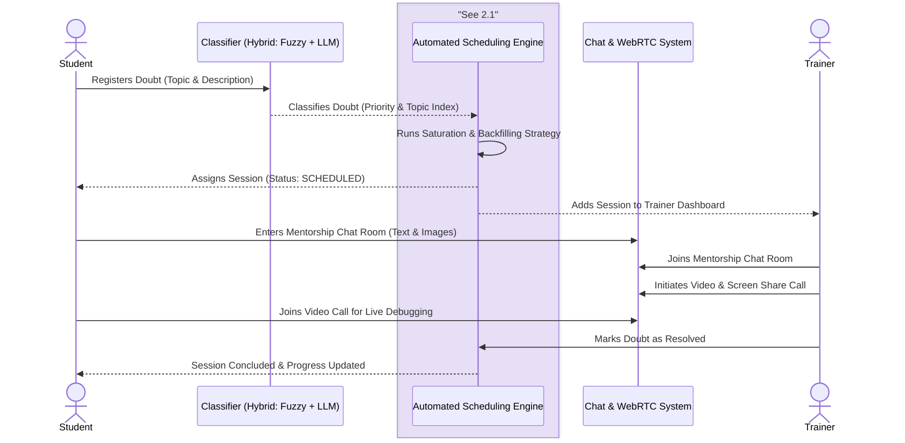

**Flow Explanation:**
The doubt resolution lifecycle begins when a student registers a query, providing a topic and description. A hybrid classifier (combining fuzzy matching and an LLM) categorizes the doubt and assigns a priority. Our Automated Scheduling Engine then processes the queue using a Saturation Strategy, finding the earliest available slot for an active trainer, and assigns the session. Both the student and trainer are notified and join a synchronized Mentorship Chat Room for text and image exchange. The trainer can escalate this chat to a live WebRTC video and screen-sharing session for hands-on debugging. Once the issue is solved, the trainer marks the doubt as resolved, concluding the session and automatically updating the student's progress metrics.

### 3. Curriculum Mastery & Risk Assessment

#### 3.1 Strict Progress Tracking Logic (Synced & Weighted)
This flow demonstrates how student progress is rigorously tracked and verified against the backend database.

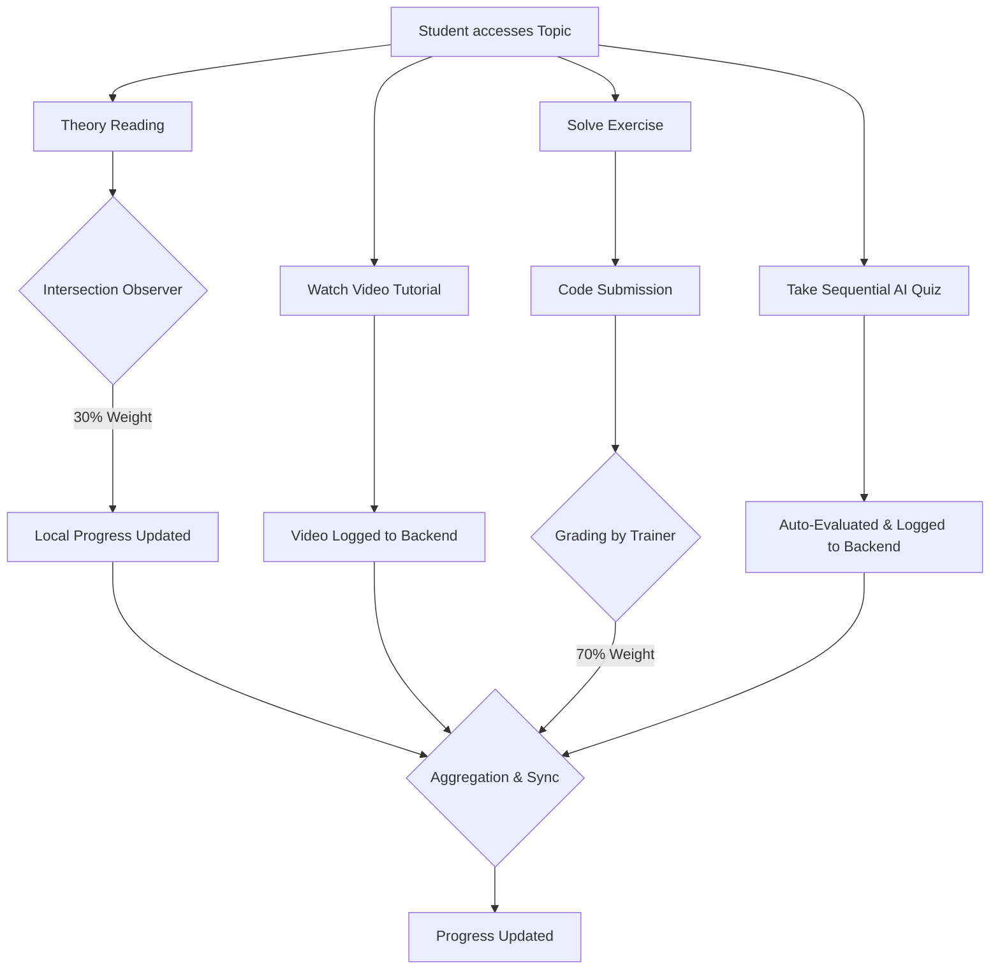

**Flow Explanation (Synced & Weighted):**
The system evaluates page "Mastery" and strictly synchronizes it with the backend database to prevent bypassing of learning paths:
- **Theory Reading (30%)**: Tracked locally via `IntersectionObserver` as students consume content.
- **Exercise Mastery (70%)**: Calculated by the ratio of successfully completed coding challenges on the page.
- **Server-Synced Valuations**: Progress is further secured by logging **Video Completions** and verifying **Quiz Evals & Exercise Evals** directly against backend evaluations to generate a true `topicStatus`.
*This hybrid approach ensures students cannot "complete" a technical topic without hands-on verified practice.*

#### 3.2 ML Engine Pipeline (Training & Inference)
This flow breaks down the internal mechanics of the machine learning model, from training on historical data to running inference on live student metrics.

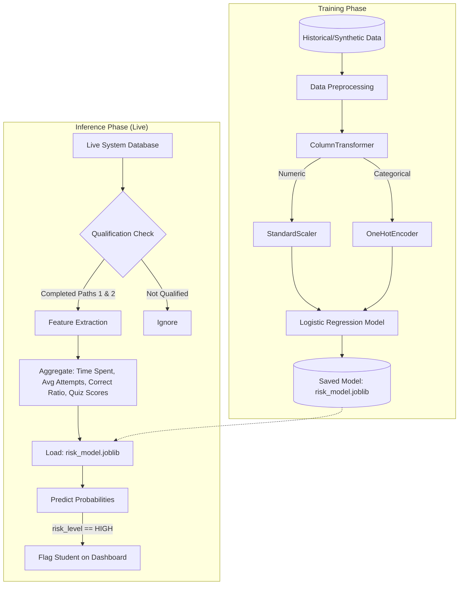

**Flow Explanation:**
The ML Engine operates in two distinct phases:
1. **Training Phase**: The system utilizes historical or synthetic student data (`synthetic_training_data.csv`). A Scikit-learn pipeline preprocesses the data using a `ColumnTransformer` (applying `StandardScaler` to numeric features like execution time, attempts, and scores, and `OneHotEncoder` to categorical statuses). A Multinomial Logistic Regression model is then trained on these features to classify risk levels and saved as a `.joblib` artifact.
2. **Inference Phase (Live)**: During live operation, the `MLService` first identifies "qualified" students (those who have fully completed all topics in Learning Paths 1 and 2). For these students, the backend aggregates live metrics from the database (average exercise attempts, code execution time, correctness ratio, and quiz scores). These aggregated metrics form a feature vector which is passed to the pre-loaded `.joblib` model. The model outputs a pass probability and a discrete risk level (e.g., LOW, MEDIUM, HIGH). Students classified as "HIGH" risk are immediately flagged on the Trainer Dashboard for intervention.

#### 3.3 ML-Powered Risk Assessment & Intervention
This scenario outlines the proactive approach taken by the platform to identify and assist struggling students based on the data gathered during progress tracking.

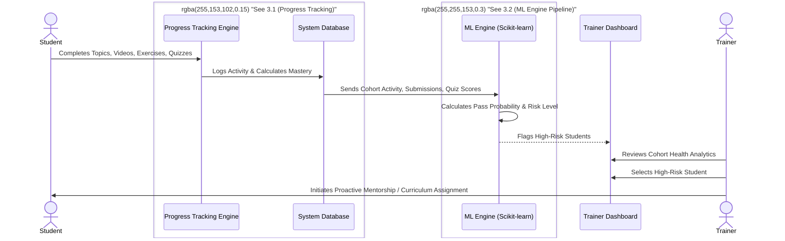

**Flow Explanation:**
JS-Mentor proactively monitors student performance using a machine learning engine (built on Scikit-learn). The system database periodically feeds the ML model with student activity data, including cohort engagement, submission frequencies, and quiz scores. The model analyzes this data to calculate a pass probability and assigns a risk level to each student. High-risk profiles are flagged and surfaced on the Trainer Dashboard under Cohort Health Analytics. This allows trainers to quickly identify struggling students, drill down into their specific pain points, and initiate proactive mentorship or assign customized remedial curriculum to prevent them from falling behind.

### 4. Domain-Specialized AI Assistance
This flow demonstrates the strict domain boundaries enforced when a student interacts with the dedicated JS-Mentor AI.

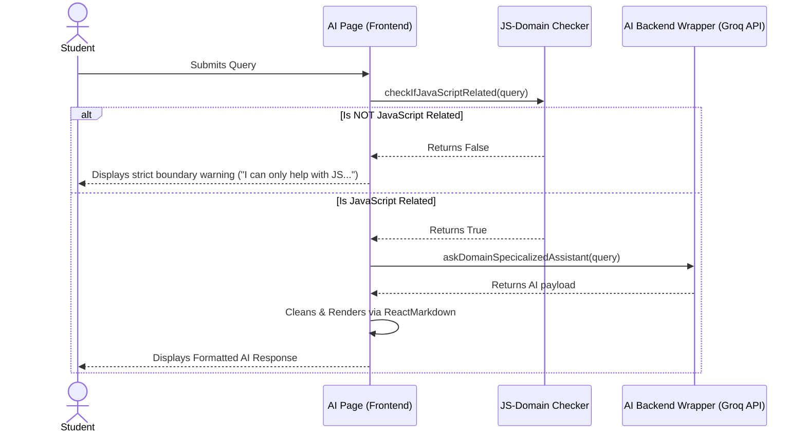

**Flow Explanation:**
To maintain a focused learning environment, JS-Mentor enforces strict domain boundaries on its AI assistant. When a student submits a query to the AI Page, a dedicated Domain Checker first analyzes the prompt. If the query is deemed unrelated to JavaScript or web development, the system immediately returns a boundary warning, politely declining to answer. If the query is domain-relevant, the request is forwarded to the AI Backend Wrapper (powered by the Groq API) for specialized processing. The resulting payload is returned, cleaned, and rendered using ReactMarkdown, providing the student with a formatted, context-aware educational response.

### 5. AI-Powered Error Explanation (Compiler)
This scenario outlines how the platform assists students when they encounter runtime errors during coding exercises.

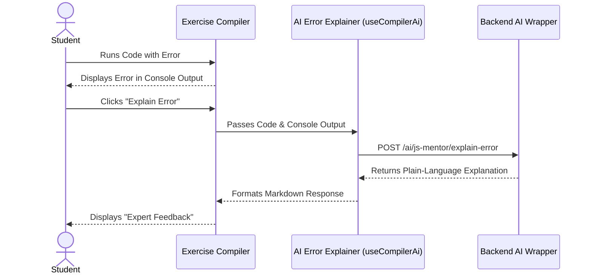

**Flow Explanation:**
Debugging is a critical skill, and our Exercise Compiler aids this process via an AI Error Explainer. When a student executes code that results in a runtime error, the compiler outputs the raw stack trace. The student can click the "Explain Error" button, which bundles their current code and the console output and sends it to the AI Backend Wrapper. The backend queries the Groq API to generate a plain-language, beginner-friendly explanation of the error. This formatted markdown response is then rendered directly within the compiler interface as "Expert Feedback", helping the student understand the root cause without simply giving away the correct code.

### 6. Anti-Cheat Proctoring Engine
This flow tracks browser visibility, window focus, and viewport layout ratios to prevent cheating via external windows, side panels, or developer tools.

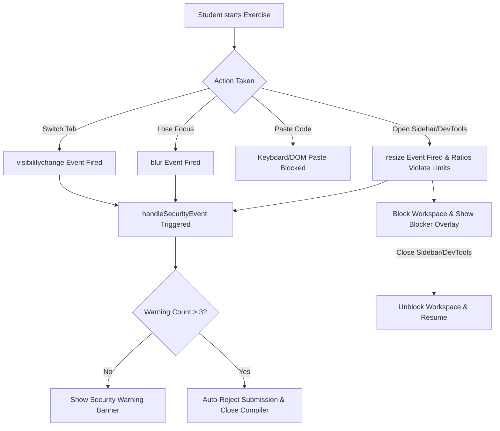

**Flow Explanation:**
To ensure the integrity of coding exercises, the Anti-Cheat Proctoring Engine continuously monitors the student's environment. If a student attempts to switch tabs (triggering `visibilitychange`), minimize the window (`blur`), or paste code directly into the editor, the system intercepts the action and triggers `handleSecurityEvent`. Furthermore, the engine monitors viewport resizing to detect the opening of browser extension sidebars (like Gemini or Copilot) or Developer Tools. Each violation increments a warning counter and displays a security banner. If the warning count exceeds the maximum allowed limit (typically 3), the engine automatically rejects the submission and locks the compiler.

### 7. AI-Assisted Quiz Evaluation & Feedback
This flow breaks down the reactive, event-driven architecture behind the interactive quizzes, utilizing `MutationObserver` to intercept DOM changes and fetch contextual AI feedback.

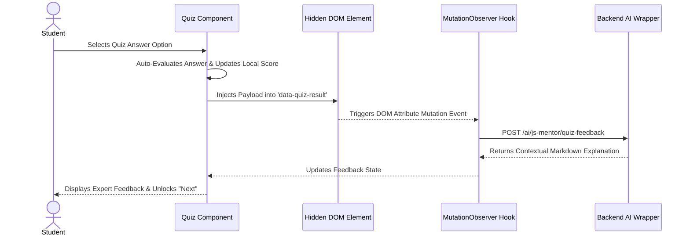

**Flow Explanation:**
The Visual Quiz system utilizes a reactive, event-driven architecture to provide instant, contextual feedback. When a student selects an answer, the Quiz Component automatically evaluates the response and updates the local score. Simultaneously, it injects a specific payload into a hidden DOM element (`data-quiz-result`). A `MutationObserver` hook listens for changes to this attribute, intercepts the payload, and triggers an asynchronous POST request to the backend AI wrapper. The backend returns a detailed markdown explanation of why the selected answer was correct or incorrect. The hook updates the feedback state, displaying the expert explanation to the student and unlocking the "Next" button to proceed.

### 8. Video Tutorial Management & Rendering Flow
This section details how trainers publish video content and how the platform processes, stores, and presents these tutorials across the application with dynamic thumbnails. We've split this into two flows for clarity: Local Video Uploads (via Cloudinary) and YouTube Embeds.

#### 8A. Local Video Upload (Cloudinary) Flow

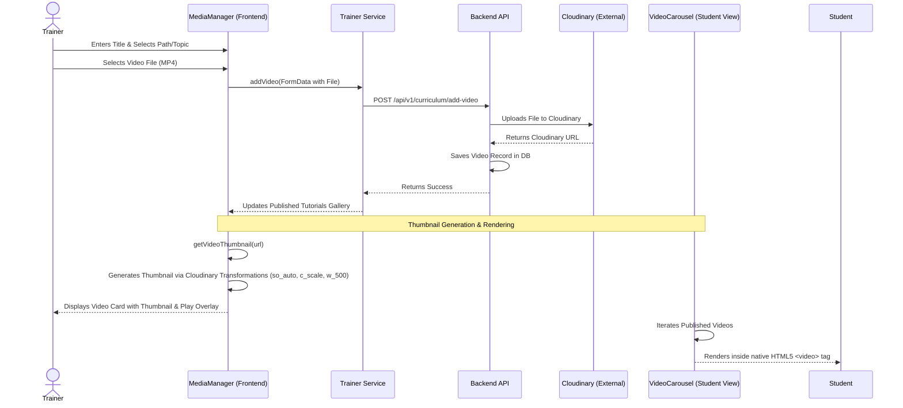

**Flow Explanation:**
When a trainer uploads a local MP4 video file, the MediaManager frontend packages the file into a `FormData` object and sends it via the Trainer Service to the Backend API. The backend acts as a secure proxy, uploading the heavy video file to Cloudinary and receiving a robust delivery URL in return. This URL is saved in the database. For rendering thumbnails in the dashboard, the frontend dynamically modifies the Cloudinary URL with transformation parameters (`so_auto, c_scale, w_500`) to extract a lightweight poster frame. On the student side, the VideoCarousel iterates through the published videos and renders the Cloudinary URL natively inside an HTML5 `<video>` tag.

#### 8B. YouTube Embed Flow

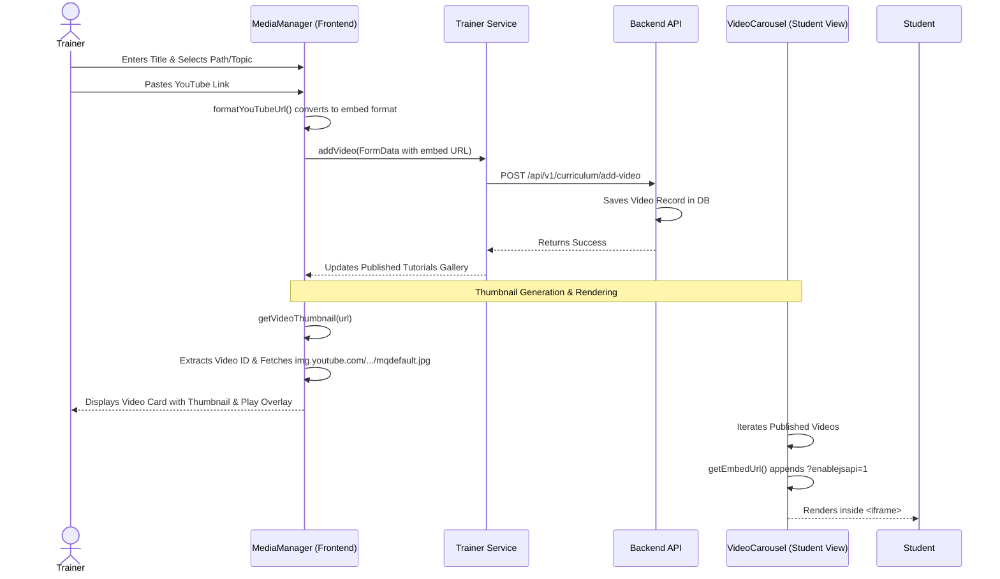

**Flow Explanation:**
For YouTube tutorials, trainers simply paste the standard watch link into the MediaManager. A formatting utility instantly converts this link into a clean `/embed/` format. This URL is sent to the backend and saved directly in the database without requiring external uploading. When generating thumbnails for the Trainer Dashboard, the system extracts the unique video ID and fetches the standard medium-quality thumbnail directly from `img.youtube.com`. In the student's VideoCarousel, the embed URL is appended with `?enablejsapi=1` (to allow programmatic tracking of video completion) and rendered seamlessly inside an `<iframe>`.

### 9. Real-Time WebRTC Mentorship Signaling
This flow outlines the complex orchestration between Socket.IO (for reliable state management and signaling) and PeerJS (for heavy P2P media streaming and dynamic screen-share track replacement) during a 1-on-1 mentorship video call.

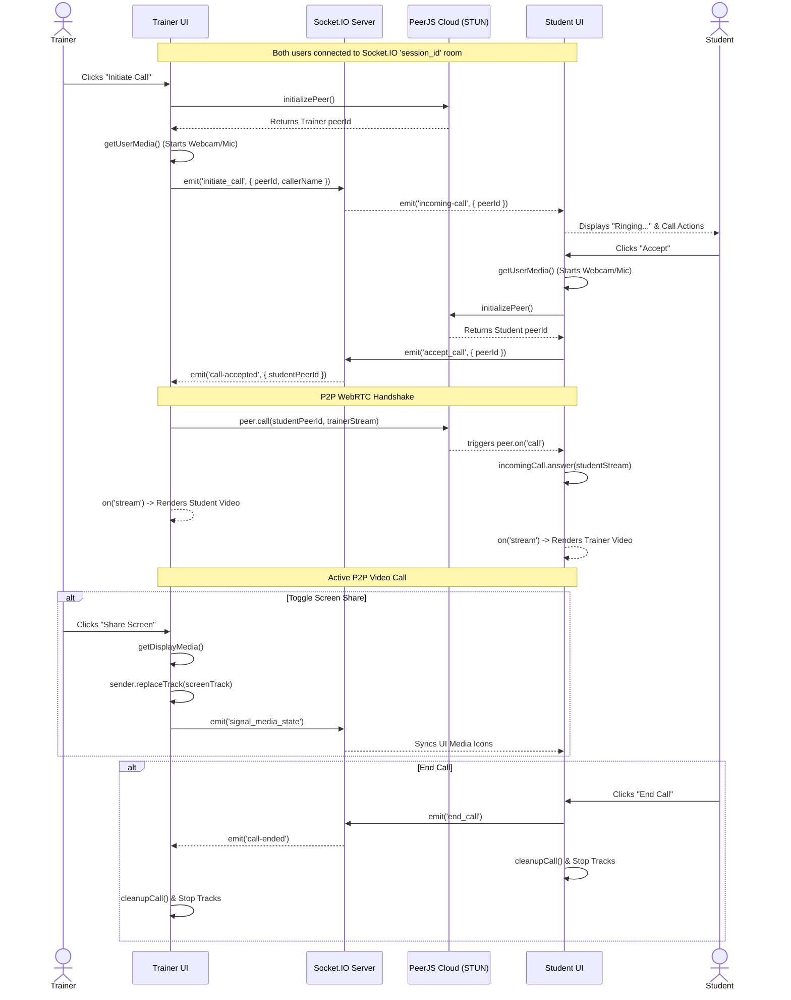

**Flow Explanation:**
The 1-on-1 mentorship call relies on a sophisticated handshake between Socket.IO and WebRTC (PeerJS). When a trainer initiates a call, their UI requests a PeerJS ID and starts their local media stream, then emits an `initiate_call` event via Socket.IO. The student's UI receives this signal and displays a ringing notification. Upon accepting, the student initializes their own stream and PeerJS ID, sending an `accept_call` acknowledgment. The trainer then uses the student's peer ID to establish a direct P2P WebRTC connection (`peer.call`). Once connected, both peers receive and render each other's remote streams. If a user toggles screen sharing, the browser's `getDisplayMedia` API is called, and the new screen track dynamically replaces the webcam track on the active WebRTC sender, while Socket.IO broadcasts a signal to synchronize the mute/camera-off UI icons across both clients.


## Technical Stack

### Frontend (The Experience)
- **Framework**: React.js
- **Authentication**: Clerk (Role-based: Student/Trainer/Institute)
- **State Management**: Context API with persistent local storage
- **Visualization**: XYFlow (Quiz Logic), Chart.js (Analytics)
- **Communication**: PeerJS (WebRTC), Socket.io-client
- **Styling**: Modern, responsive UI with custom CSS (Glassmorphism, Vibrant Accents, and Light/Dark Mode support)

### Backend (The Engine)
- **API Framework**: FastAPI (Python)
- **Database**: PostgreSQL (Production) / MySQL (Dev)
- **Scheduling**: Custom Python-based logic engine with FIFO and Saturation strategies
- **ML Engine**: Scikit-learn for student risk prediction models
- **Deployment**: Dockerized services for scalable delivery

---


## Database ER Diagrams

To improve visibility, the database schema is divided into three core domains:

### 1. Core Profiles & Authentication

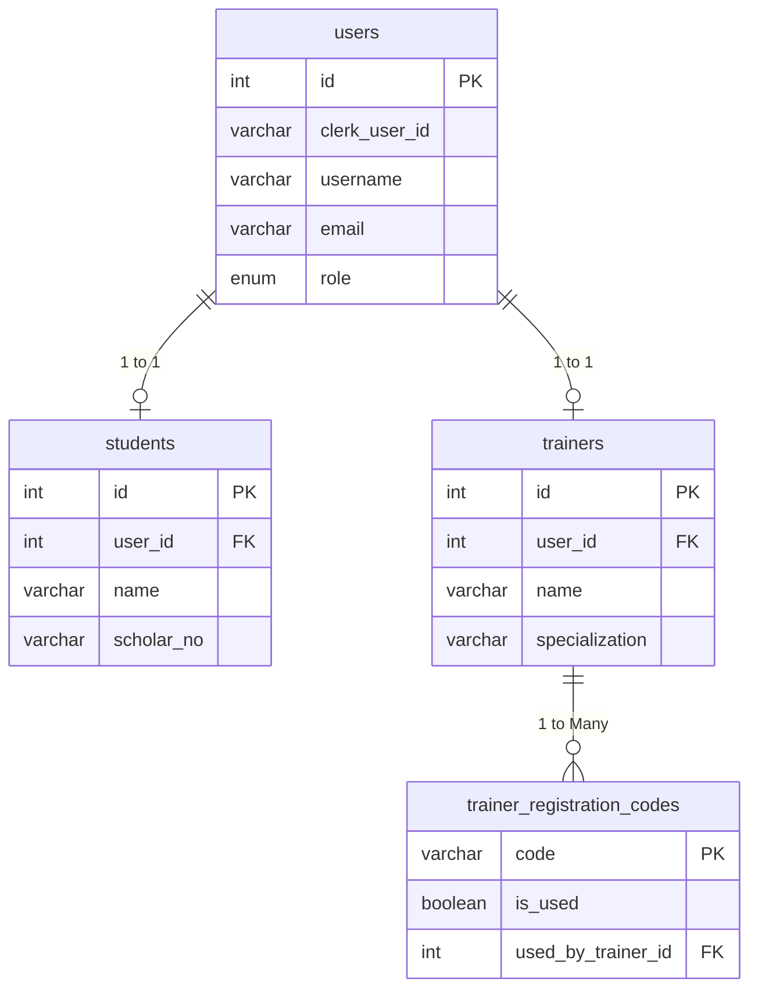

### 2.1 Evaluation & Progress

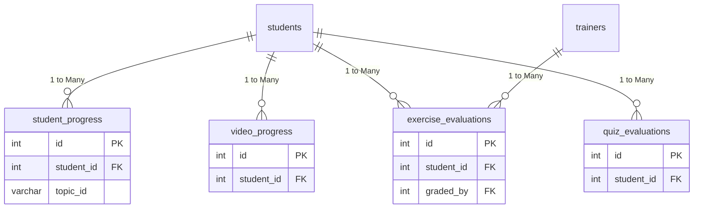

### 2.2 Curriculum & Risk Predictions

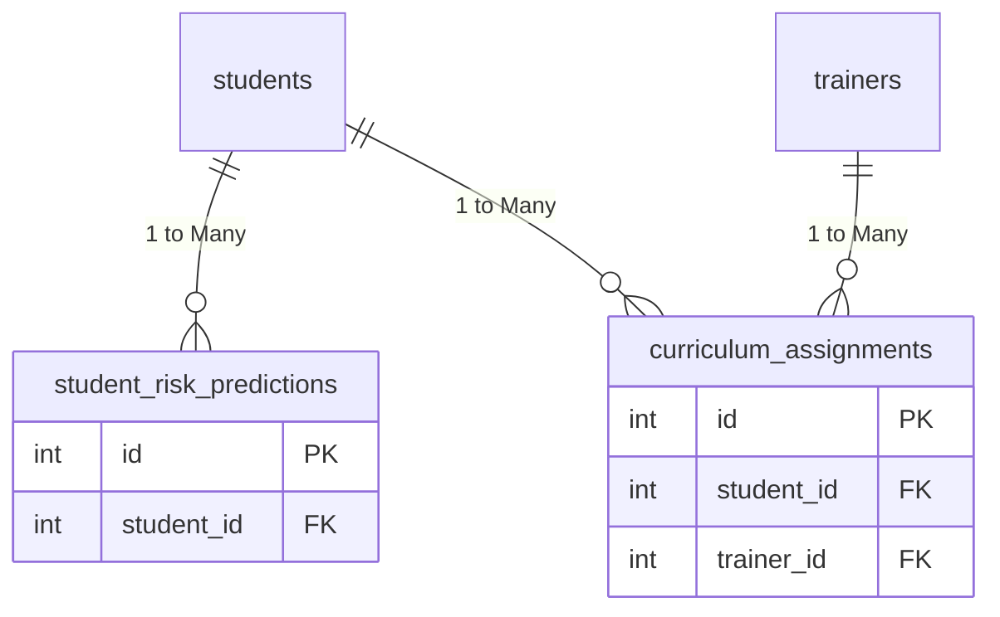

### 3. Mentorship & Interaction

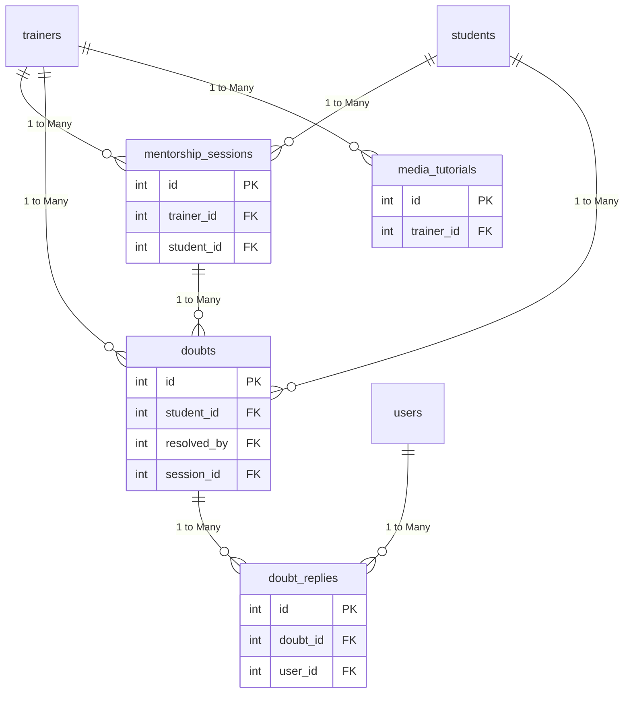

---

## Data Dictionary

### Table Overviews

| Table Name | Description | Related Tables |
| :--- | :--- | :--- |
| **`users`** | Core authentication profiles mapping Clerk credentials to platform roles. | `students`, `trainers`, `doubt_replies` |
| **`students`** | Specific profiles for students containing academic details like scholar numbers. | `users`, `student_progress`, `exercise_evaluations`, `quiz_evaluations`, `student_risk_predictions`, `mentorship_sessions`, `doubts`, `curriculum_assignments`, `video_progress` |
| **`trainers`** | Specific profiles for trainers containing their specialized areas. | `users`, `trainer_registration_codes`, `exercise_evaluations`, `mentorship_sessions`, `doubts`, `curriculum_assignments`, `media_tutorials` |
| **`trainer_registration_codes`** | Pre-authorized codes used by trainers to register onto the platform. | `trainers` |
| **`student_progress`** | Tracks student progress and time spent across various learning paths/topics. | `students` |
| **`exercise_evaluations`** | Records student coding submissions, attempts, and grades provided by trainers. | `students`, `trainers` |
| **`quiz_evaluations`** | Logs student scores, attempts, and pass/fail statuses for visual quizzes. | `students` |
| **`student_risk_predictions`** | Stores machine-learning driven risk assessments and probability of student failure. | `students` |
| **`mentorship_sessions`** | Manages scheduled and active 1-on-1 sessions between trainers and students. | `trainers`, `students`, `doubts` |
| **`doubts`** | Represents individual queries or issues raised by students waiting for resolution. | `students`, `trainers`, `mentorship_sessions`, `doubt_replies` |
| **`doubt_replies`** | Chat messages and replies within a specific doubt thread. | `doubts`, `users` |
| **`curriculum_assignments`** | Links specific learning paths assigned to students by trainers with due dates. | `trainers`, `students` |
| **`media_tutorials`** | References external media tutorials (e.g., videos) uploaded or linked by trainers. | `trainers` |
| **`video_progress`** | Tracks the completion status and watched seconds for individual student video access. | `students` |

---

## Getting Started

### 1. Frontend Setup
The frontend of JS-Mentor is built with React.js and is developed on the `main` branch.

**1. Clone the repository and checkout the main branch:**
```bash
git clone https://github.com/suyash-rgb/JS-Mentor.git
cd JS-Mentor
git checkout dev
```

**2. Install dependencies:**
```bash
npm install
```

**3. Environment Configuration:**
Create a `.env` file in the root directory:
```env
REACT_APP_CLERK_PUBLISHABLE_KEY=your_clerk_key
REACT_APP_API_BASE_URL=http://localhost:
REACT_APP_GROQ_API_URL=your_groq_api_url
REACT_APP_GROQ_API_KEY=your_groq_api_key
REACT_APP_GROQ_MODEL=your_groq_model
```

**4. Start the Frontend Engine:**
```bash
npm start
```

### 2. Backend Setup
The backend is powered by FastAPI and is developed on the `backend` branch.

**1. Clone the repository and checkout the backend branch:**
*(If you already cloned it for the frontend, clone it in a separate folder or just switch branches if not running simultaneously)*
```bash
git clone https://github.com/suyash-rgb/JS-Mentor.git JS-Mentor-Backend
cd JS-Mentor-Backend
git checkout backend
```

**2. Set up Virtual Environment & Install Dependencies:**
```bash
python -m venv venv
# Activate venv: `venv\Scripts\activate` on Windows or `source venv/bin/activate` on macOS/Linux
pip install -r requirements.txt
```

**3. Environment Configuration:**
Create a `.env` file in the backend root directory containing:
```env
DATABASE_URL=your_database_url
SECRET_KEY=your_secret_key
JWT_ALGORITHM=your_jwt_algorithm
CLERK_SIGNING_SECRET=your_clerk_signing_secret
FRONTEND_URL=your_frontend_url
FASTAPI_GROQ_API_KEY=your_groq_api_key
FASTAPI_GROQ_API_URL=your_groq_api_url
FASTAPI_GROQ_MODEL=your_groq_model
CLOUDINARY_CLOUD_NAME=your_cloudinary_cloud_name
CLOUDINARY_API_KEY=your_cloudinary_api_key
CLOUDINARY_API_SECRET=your_cloudinary_api_secret
```

**4. Start the Backend Engine:**
```bash
uvicorn app.main:app --reload
```

---


## Contribution & Governance
We use a structured branching strategy:
- `main`: Production-ready, stable releases.
- `dev`: Active frontend development and integration.
- `backend`: Core API and microservices development.

For more details, refer to the inline documentation and code comments throughout the repository. For detailed API documentation, refer to the `SCHEDULER_LOGIC.md` and `trainer_dashboard_apis.md` files. Happy coding!

---
*Developed for the JavaScript Community.*
