# JS-Mentor: The Ultimate AI/ML Powered JavaScript LMS

JS-Mentor is a state-of-the-art, feature-rich Learning Management System (LMS) specifically engineered for mastering JavaScript. It merges interactive curriculum delivery with cutting-edge AI assistance, real-time mentorship tools, and machine-learning-driven student analytics to create a holistic learning ecosystem.

<br>


---

## Contents

- [About the Application](#about-the-application)
- [Key Features of the Platform](#key-features-of-the-platform)
- [System Architecture (C4 Model & Logical Architecture)](#system-architecture-c4-model--logical-architecture)
- [Key User Workflows & Scenarios](#key-user-workflows--scenarios)
- [ML Model & Dataset](#ml-model--dataset)
- [Evolution of the Project](#evolution-of-the-project)
- [Technical Stack](#technical-stack)
- [Database ER Diagram](#database-er-diagram)
- [Data Dictionary](#data-dictionary)
- [Getting Started](#getting-started)
- [API Documentation](#api-documentation)
- [Contribution & Governance](#contribution--governance)

---

## About the Application

### Background & Motivation
In the current EdTech landscape, traditional Learning Management Systems (LMS) are often static, offering video lectures and simple quizzes but lacking the personalized, real-time guidance that students need when they get stuck. For learners tackling complex subjects like JavaScript, this "passive consumption" model leads to high dropout rates. **JS-Mentor** was born out of the need for an intelligent, active learning environment. While standard courses provide the "what," JS-Mentor provides the "how" through continuous tracking and adaptive support. Our motivation is to build a system that bridges the gap between self-paced learning and 1-on-1 tutoring by combining an interactive coding curriculum with an AI mentor, peer-to-peer WebRTC video calls, and a predictive Machine Learning engine that flags struggling students before they fail.

### Why it Matters
In the EdTech domain, JS-Mentor demonstrates that continuous behavioral tracking can be significantly more valuable than static assessments for improving student outcomes. It showcases the practical application of integrating modern web technologies (WebSockets, WebRTC, FastAPI) with algorithmic Machine Learning in a production environment to create a truly adaptive educational platform.

---

## Key Features of the Platform

### 1. AI-Driven Learning Experience
*   **Domain-Specialized AI Assistant**: A dedicated JavaScript mentor available 24/7, providing context-aware guidance without giving away direct answers.

    

*   **AI Error Explanation**: Integrated with the online compiler, this feature detects runtime failures and uses the Groq API to provide friendly, plain-language explanations of complex errors.

    

*   **Smart Chatbot**: A persistent, sleek UI component for quick Q&A, featuring markdown support, code highlighting, and seamless redirection to deep-dive AI pages.

### 2. Real-time Mentorship & Collaboration
*   **1-on-1 Video & Screen Sharing**: Built on PeerJS, allowing trainers to initiate instant high-quality video calls and screen-sharing sessions directly within the browser.

    


*   **Unified Mentorship Chat**: A robust WebSocket-based messaging system for seamless student-trainer communication.

    


*   **Automated Scheduling Engine**: A sophisticated backend engine that manages doubt sessions using a **Saturation Strategy**. It prioritizes trainer efficiency and supports dynamic backfilling for resolved or cancelled slots.

### 3. Trainer Dashboard & Analytics
*   **Cohort Health Analytics**: Real-time visualization of student progress, completion rates, and engagement metrics across different learning paths.

    

*   **Curriculum Management**: Easily structure and organize learning paths, theoretical topics, and coding exercises to streamline student progression.

    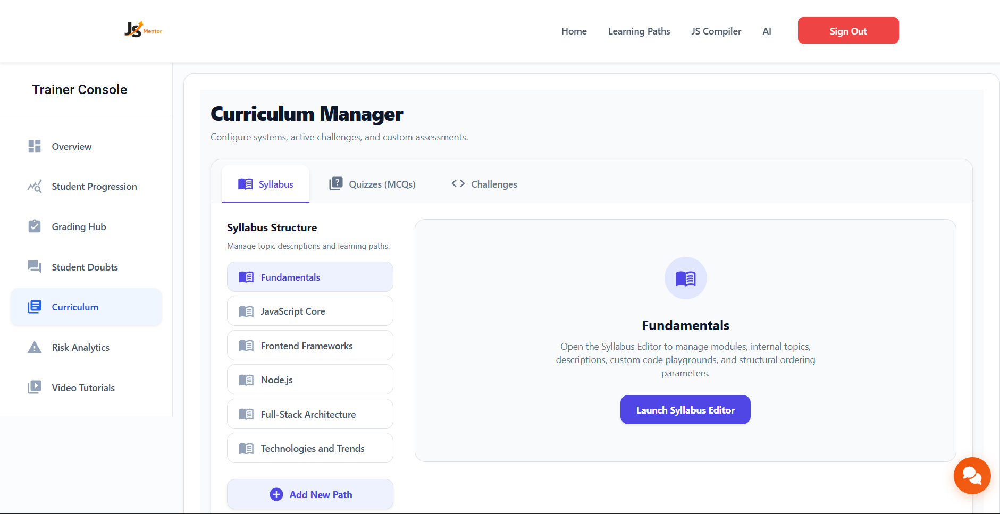


*   **ML-Powered Risk Assessment**: Uses machine learning to predict "High-Risk" students based on their activity patterns, submission delays, and quiz scores.

*   **Student Progression**: Track cohort learner progress, completion rates, and module-specific achievements in real-time.

    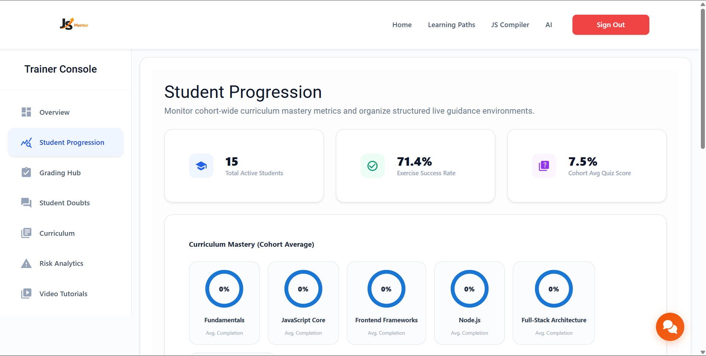


*   **Grading Hub**: A centralized interface for trainers to review, grade, and provide feedback on coding exercises.

    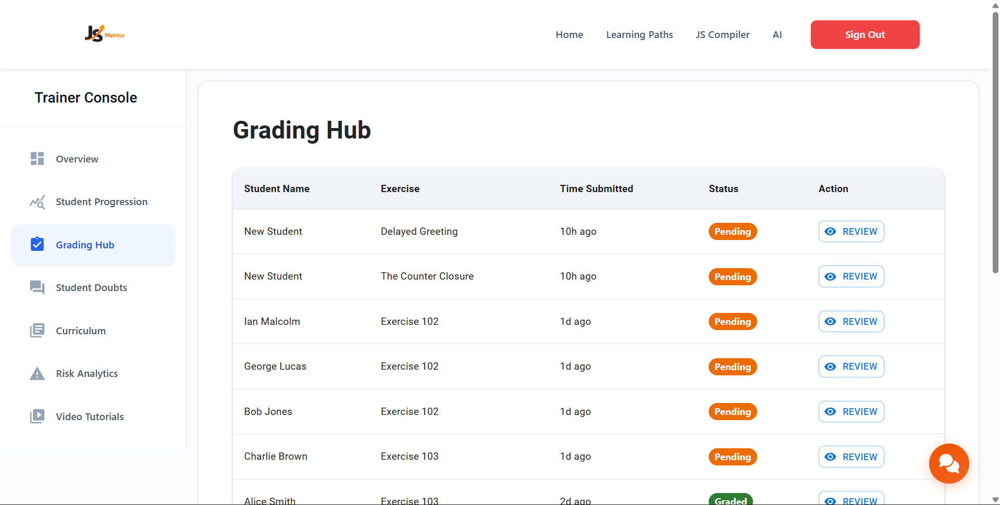


### 4. Advanced Content Management
*   **Visual Quiz Builder (XYFlow)**: A node-based, interactive builder for creating quizzes.

    
  
*   **Dynamic Learning Paths**: Support for atomic theory reading and exercise-based competency tracking and dynamic rendering of content, videos, quizzes and exercises based on the leaning paths.

    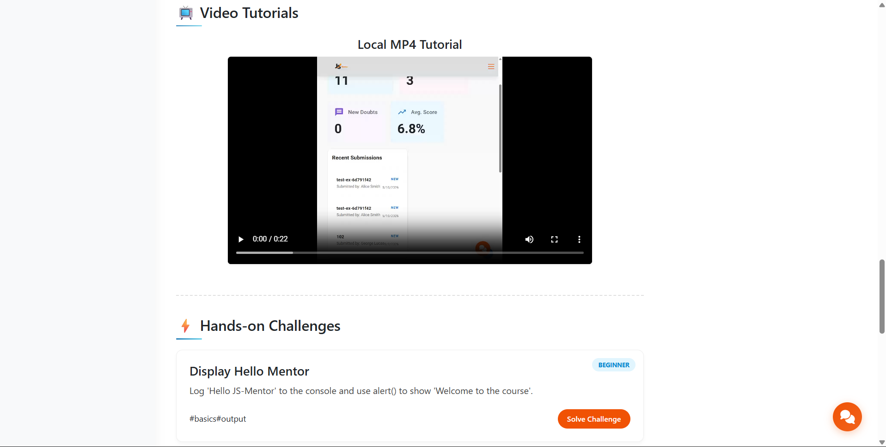

*   **Media Manager**: Integrated Cloudinary support for ephemeral image uploads and self-cleaning media management. Supports both YouTube and local video tutorials.

    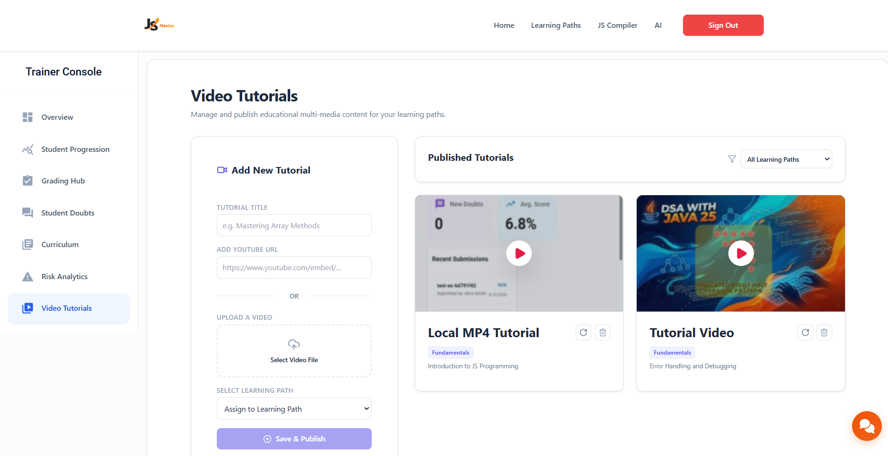


---

## System Architecture (C4 Model & Logical Architecture)

To help visualize the static architecture of JS-Mentor and map how its inner modules sit next to each other, the platform utilizes the developer-friendly **C4 Model** framework.

### 1. System Context Diagram (Zoom Level 1)
The System Context diagram displays the entire JS-Mentor application as a single "black box" in the center, highlighting how users (Students and Trainers) interact with it, as well as the external systems it depends on for OAuth, AI functionality, media delivery, and WebRTC streaming.

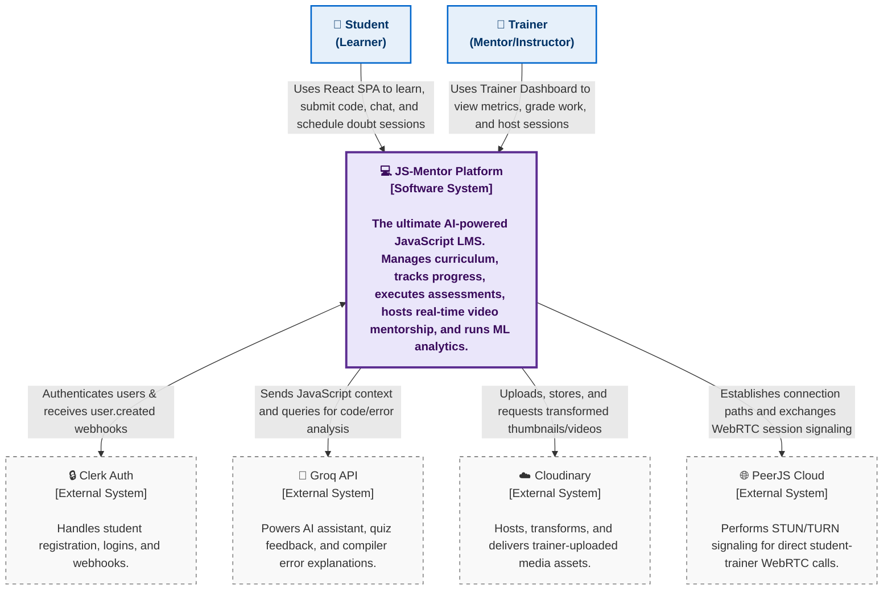
```mermaid
flowchart TD
    %% Styling Classes
    classDef actor fill:#E6F0FA,stroke:#0066CC,stroke-width:2px,color:#003366,font-weight:bold;
    classDef system fill:#EAE6FA,stroke:#5c2d91,stroke-width:3px,color:#3a0b5c,font-weight:bold;
    classDef external fill:#F9F9F9,stroke:#666666,stroke-width:1px,color:#333333,stroke-dasharray: 5 5;

    %% Nodes
    Student["👤 Student<br/>(Learner)"]:::actor
    Trainer["👤 Trainer<br/>(Mentor/Instructor)"]:::actor
    
    JS_Mentor["💻 JS-Mentor Platform<br/>[Software System]<br/><br/>The ultimate AI-powered JavaScript LMS. Manages curriculum, tracks progress, executes assessments, hosts real-time video mentorship, and runs ML analytics."]:::system

    Clerk["🔒 Clerk Auth<br/>[External System]<br/><br/>Handles student registration, logins, and webhooks."]:::external
    Groq["🤖 Groq API<br/>[External System]<br/><br/>Powers AI assistant, quiz feedback, and compiler error explanations."]:::external
    Cloudinary["☁️ Cloudinary<br/>[External System]<br/><br/>Hosts, transforms, and delivers trainer-uploaded media assets."]:::external
    PeerJS["🌐 PeerJS Cloud<br/>[External System]<br/><br/>Performs STUN/TURN signaling for direct student-trainer WebRTC calls."]:::external

    %% Connections
    Student -->|"Uses React SPA to learn, submit code, chat, and schedule doubt sessions"| JS_Mentor
    Trainer -->|"Uses Trainer Dashboard to view metrics, grade work, and host sessions"| JS_Mentor

    JS_Mentor <-->|"Authenticates users & receives user.created webhooks"| Clerk
    JS_Mentor -->|"Sends JavaScript context and queries for code/error analysis"| Groq
    JS_Mentor -->|"Uploads, stores, and requests transformed thumbnails/videos"| Cloudinary
    JS_Mentor -->|"Establishes connection paths and exchanges WebRTC session signaling"| PeerJS
```

### 2. Container Diagram (Zoom Level 2)
Zooming into the JS-Mentor "black box", the Container diagram maps the high-level runnable containers of our tech stack: the React.js frontend, the FastAPI backend, and the PostgreSQL database.

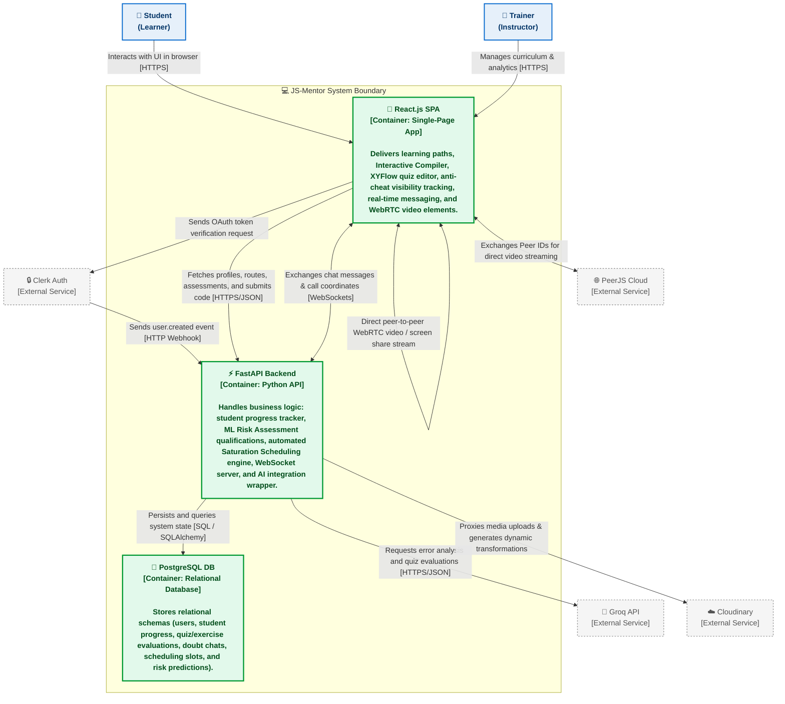
```mermaid
flowchart TD
    %% Styling Classes
    classDef actor fill:#E6F0FA,stroke:#0066CC,stroke-width:2px,color:#003366,font-weight:bold;
    classDef container fill:#E2F9EB,stroke:#009933,stroke-width:2.5px,color:#004D1A,font-weight:bold;
    classDef ext_container fill:#F5F5F5,stroke:#999999,stroke-width:1.5px,color:#555555,stroke-dasharray: 3 3;

    %% Actors
    Student["👤 Student<br/>(Learner)"]:::actor
    Trainer["👤 Trainer<br/>(Instructor)"]:::actor

    subgraph JS_System ["💻 JS-Mentor System Boundary"]
        Frontend["🎨 React.js SPA<br/>[Container: Single-Page App]<br/><br/>Delivers learning paths, Interactive Compiler, XYFlow quiz editor, anti-cheat visibility tracking, real-time messaging, and WebRTC video elements."]:::container
        Backend["⚡ FastAPI Backend<br/>[Container: Python API]<br/><br/>Handles business logic: student progress tracker, ML Risk Assessment qualifications, automated Saturation Scheduling engine, WebSocket server, and AI integration wrapper."]:::container
        Database["💾 PostgreSQL DB<br/>[Container: Relational Database]<br/><br/>Stores relational schemas (users, student progress, quiz/exercise evaluations, doubt chats, scheduling slots, and risk predictions)."]:::container
    end

    %% External Systems
    Clerk["🔒 Clerk Auth<br/>[External Service]"]:::ext_container
    Groq["🤖 Groq API<br/>[External Service]"]:::ext_container
    Cloudinary["☁️ Cloudinary<br/>[External Service]"]:::ext_container
    PeerJS["🌐 PeerJS Cloud<br/>[External Service]"]:::ext_container

    %% Relationships
    Student -->|"Interacts with UI in browser [HTTPS]"| Frontend
    Trainer -->|"Manages curriculum & analytics [HTTPS]"| Frontend

    Frontend -->|"Sends OAuth token verification request"| Clerk
    Clerk -->|"Sends user.created event [HTTP Webhook]"| Backend

    Frontend -->|"Fetches profiles, routes, assessments, and submits code [HTTPS/JSON]"| Backend
    Frontend <-->|"Exchanges chat messages & call coordinates [WebSockets]"| Backend
    Frontend <-->|"Exchanges Peer IDs for direct video streaming"| PeerJS
    Frontend <-->|"Direct peer-to-peer WebRTC video / screen share stream"| Frontend

    Backend -->|"Persists and queries system state [SQL / SQLAlchemy]"| Database
    Backend -->|"Requests error analysis and quiz evaluations [HTTPS/JSON]"| Groq
    Backend -->|"Proxies media uploads & generates dynamic transformations"| Cloudinary
```

### 3. Logical Architecture & Subsystem Interactions

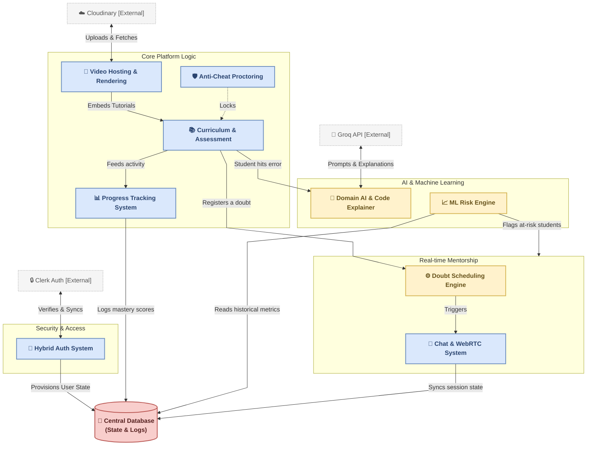
```mermaid
%%{init: {"flowchart": {"curve": "linear"}}}%%
flowchart TD
    %% Styling Classes
    classDef engine fill:#FFF2CC,stroke:#D6B656,stroke-width:2px,color:#66521A,font-weight:bold;
    classDef subsystem fill:#DAE8FC,stroke:#6C8EBF,stroke-width:2px,color:#2A446F,font-weight:bold;
    classDef db fill:#F8CECC,stroke:#B85450,stroke-width:2px,color:#56201F,font-weight:bold;
    classDef ext fill:#F5F5F5,stroke:#999999,stroke-width:1px,color:#555555,stroke-dasharray: 2 2;

    %% External APIs (Top Level)
    Clerk["🔒 Clerk Auth [External]"]:::ext
    Cloudinary["☁️ Cloudinary [External]"]:::ext
    Groq["🤖 Groq API [External]"]:::ext

    %% Logical Subsystems (Mid Level)
    subgraph Security ["Security & Access"]
        AuthSystem["🔐 Hybrid Auth System"]:::subsystem
    end

    subgraph Core_Platform ["Core Platform Logic"]
        VideoSystem["🎥 Video Hosting & Rendering"]:::subsystem
        AntiCheat["🛡️ Anti-Cheat Proctoring"]:::subsystem
        Curriculum["📚 Curriculum & Assessment"]:::subsystem
        Progress["📊 Progress Tracking System"]:::subsystem
    end

    subgraph Intelligence ["AI & Machine Learning"]
        AIAssistant["🤖 Domain AI & Code Explainer"]:::engine
        MLEngine["📈 ML Risk Engine"]:::engine
    end

    subgraph Mentorship ["Real-time Mentorship"]
        Scheduler["⚙️ Doubt Scheduling Engine"]:::engine
        ChatWebRTC["💬 Chat & WebRTC System"]:::subsystem
    end

    %% Database (Bottom Level)
    Database[("💾 Central Database<br/>(State & Logs)")]:::db

    %% External Interactions
    Clerk <-->|Verifies & Syncs| AuthSystem
    Cloudinary <-->|Uploads & Fetches| VideoSystem
    Groq <-->|Prompts & Explanations| AIAssistant

    %% Internal Routing (Flowing Downwards)
    VideoSystem -->|Embeds Tutorials| Curriculum
    AntiCheat -.->|Locks| Curriculum
    
    Curriculum -->|Feeds activity| Progress
    Curriculum -->|Student hits error| AIAssistant
    Curriculum -->|Registers a doubt| Scheduler
    
    MLEngine -->|Flags at-risk students| Mentorship
    Scheduler -->|Triggers| ChatWebRTC
    
    %% Database Sink (Everything points down to DB)
    AuthSystem -->|Provisions User State| Database
    Progress -->|Logs mastery scores| Database
    MLEngine -->|Reads historical metrics| Database
    ChatWebRTC -->|Syncs session state| Database
```

---

## Key User Workflows & Scenarios

### 1. Dual Authentication & Registration Flow
This flow details how students and trainers access the platform using completely distinct authentication strategies.

#### 1.1 Student Flow
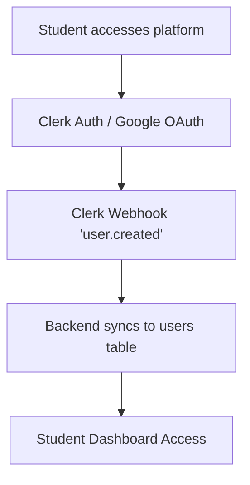
```mermaid
flowchart TD
    S1[Student accesses platform] --> S2[Clerk Auth / Google OAuth]
    S2 --> S3[Clerk Webhook 'user.created']
    S3 --> S4[Backend syncs to users table]
    S4 --> S5[Student Dashboard Access]
```

**Flow Explanation:**
When a student accesses the JS-Mentor platform, they are routed through Clerk's authentication system, typically utilizing Google OAuth for a frictionless sign-in experience. Once the student successfully authenticates, Clerk triggers a `user.created` webhook. Our backend intercepts this webhook to securely synchronize the new user's credentials into our primary database (`users` and `students` tables). This ensures the student's dashboard is fully provisioned and ready for access without any manual registration steps.

#### 1.2 Trainer Flow
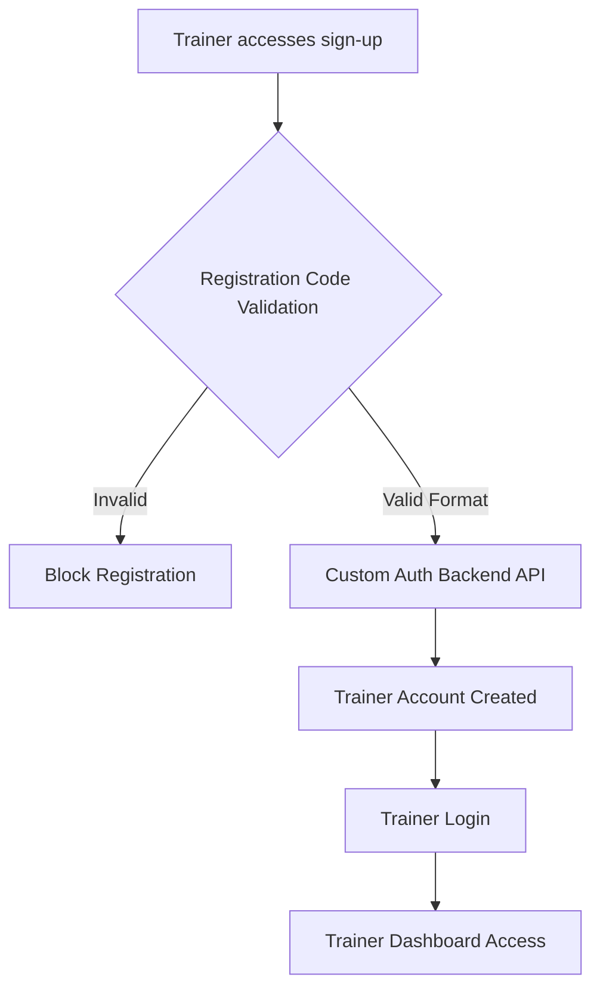
```mermaid
flowchart TD
    T1[Trainer accesses sign-up] --> T2{Registration Code Validation}
    T2 -- Invalid --> T3[Block Registration]
    T2 -- Valid Format --> T4[Custom Auth Backend API]
    T4 --> T5[Trainer Account Created]
    T5 --> T6[Trainer Login]
    T6 --> T7[Trainer Dashboard Access]
```

**Flow Explanation:**
The trainer onboarding process enforces strict access control. When a prospective trainer attempts to sign up, they must provide a pre-authorized Registration Code. The system validates this code format; invalid codes immediately block the registration attempt. Valid codes proceed to a custom backend authentication API which creates the specific trainer account and links the consumed code. Subsequently, the trainer can log in using their newly created credentials to access the specialized Trainer Dashboard.

### 2. Doubt Lifecycle & Resolution

#### 2.1 Doubt Scheduling Engine/Algorithm
The JS-Mentor Doubt Scheduling Engine is designed to maximize trainer efficiency through a **Saturation & Dynamic Backfilling** strategy.

##### ── Business Rules ──

1.  **Availability**: No doubt sessions are scheduled on **Sundays**.
2.  **Trainer Shifts**: The active window is **10:00 AM – 4:00 PM** (6 hours/day).
3.  **Durations**:
    *   Learning Paths 1 & 2 → **30-minute** sessions.
    *   Learning Paths 3 – 6 → **60-minute** sessions.
4.  **Priority**: Doubts are processed **FIFO** (oldest request first).
5.  **Saturation Strategy**: The engine fills one trainer's schedule completely before assigning tasks to the next available trainer.
6.  **Dynamic Backfilling**: If a session is resolved early or a trainer goes online mid-day, the engine can "tap into" the current time to fill newly available gaps.

##### ── Algorithmic Flow ──


```mermaid
graph TD
    Start([Start Run]) --> IsSunday{Is it Sunday?}
    
    IsSunday -- Yes --> Reject[Reject & Stop]
    IsSunday -- No --> FetchData[Fetch OPEN Doubts & Available Trainers]
    
    FetchData --> LoopDoubt{For Each <br/> Pending Doubt}
    
    LoopDoubt -- Done --> Commit[Commit Changes & Return Report]
    
    LoopDoubt -- Next --> SortTrainers[Sort Trainers by Booked Minutes DESC <br/> 'Saturation Strategy']
    
    SortTrainers --> PickTrainer[For each Trainer in sorted list]
    
    PickTrainer --> CapacityCheck{Total Booked + New <br/> <= 360 mins?}
    
    CapacityCheck -- No --> NextTrainer[Try Next Trainer]
    
    CapacityCheck -- Yes --> FindSlot{Earliest Free Slot <br/> >= max 10AM, NOW}
    
    FindSlot -- No --> NextTrainer
    
    FindSlot -- Yes --> CreateSession[Create MentorshipSession <br/> Status = 'SCHEDULED']
    CreateSession --> UpdateDoubt[Link Doubt to Session <br/> Status = 'SCHEDULED']
    UpdateDoubt --> LoopDoubt

    NextTrainer --> LoopDoubt
```

##### ── Optimization Details ──

**1. Saturation Sorting**
Instead of spreading the load (Load Balancing), we sort trainers by their already booked minutes in **descending** order. This ensures that the engine tries to "top up" the trainer who is already working, keeping other trainers free unless necessary.

**2. Dynamic "Now" Floor**
When searching for an available slot (`_next_free_slot`), the engine uses `max(SESSION_START, CURRENT_TIME)`. This allows for **immediate scheduling** of new doubts into the current day's gaps, rather than waiting for the next day.

**3. Reactive Triggers**
The engine doesn't just run on a schedule. It is reactively triggered when:
*   A **Student** registers a new doubt.
*   A **Trainer** marks a session as resolved (freeing up their remaining time).

#### 2.2 Full Resolution Lifecycle
This scenario illustrates the journey of a student's doubt from registration to resolution.

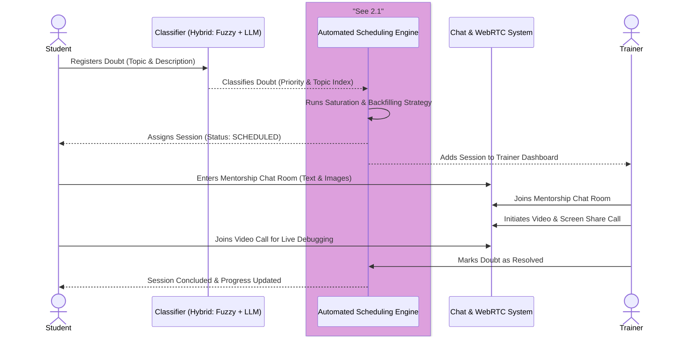
```mermaid
sequenceDiagram
    actor S as Student
    participant C as Classifier (Hybrid: Fuzzy + LLM)
    
    box Plum "See 2.1"
    participant E as Automated Scheduling Engine
    end
    
    participant CH as Chat & WebRTC System
    actor T as Trainer

    S->>C: Registers Doubt (Topic & Description)
    C-->>E: Classifies Doubt (Priority & Topic Index)
    E->>E: Runs Saturation & Backfilling Strategy
    E-->>S: Assigns Session (Status: SCHEDULED)
    E-->>T: Adds Session to Trainer Dashboard
    S->>CH: Enters Mentorship Chat Room (Text & Images)
    T->>CH: Joins Mentorship Chat Room
    T->>CH: Initiates Video & Screen Share Call
    S->>CH: Joins Video Call for Live Debugging
    T->>E: Marks Doubt as Resolved
    E-->>S: Session Concluded & Progress Updated
```

**Flow Explanation:**
The doubt resolution lifecycle begins when a student registers a query, providing a topic and description. A hybrid classifier (combining fuzzy matching and an LLM) categorizes the doubt and assigns a priority. Our Automated Scheduling Engine then processes the queue using a Saturation Strategy, finding the earliest available slot for an active trainer, and assigns the session. Both the student and trainer are notified and join a synchronized Mentorship Chat Room for text and image exchange. The trainer can escalate this chat to a live WebRTC video and screen-sharing session for hands-on debugging. Once the issue is solved, the trainer marks the doubt as resolved, concluding the session and automatically updating the student's progress metrics.

### 3. Curriculum Mastery & Risk Assessment

#### 3.1 Strict Progress Tracking Logic (Synced & Weighted)
This flow demonstrates how student progress is rigorously tracked and verified against the backend database.

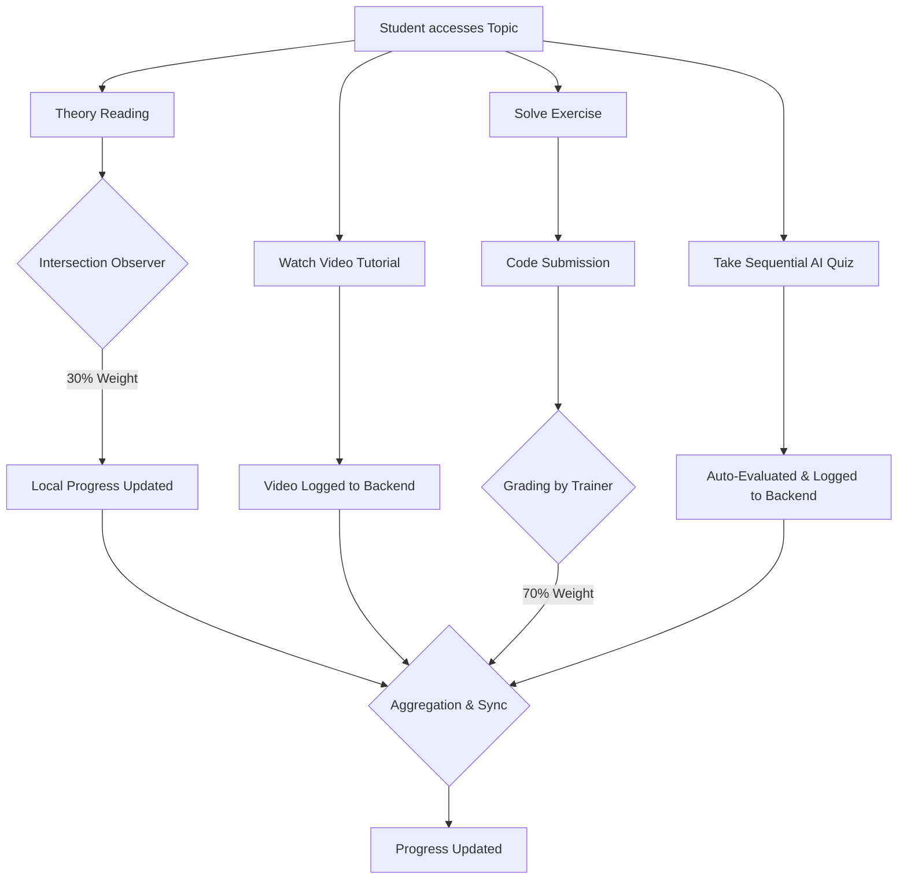
```mermaid
flowchart TD
    A[Student accesses Topic] --> B[Theory Reading]
    B --> C{Intersection Observer}
    C -- 30% Weight --> D[Local Progress Updated]
    
    A --> E[Watch Video Tutorial]
    E --> F[Video Logged to Backend]
    
    A --> G[Solve Exercise]
    G --> H[Code Submission]
    H --> I{Grading by Trainer}
    
    A --> J[Take Sequential AI Quiz]
    J --> K[Auto-Evaluated & Logged to Backend]
    
    D --> L{Aggregation & Sync}
    F --> L
    I -- 70% Weight --> L
    K --> L
    
    L --> M[Progress Updated]
```

**Flow Explanation (Synced & Weighted):**
The system evaluates page "Mastery" and strictly synchronizes it with the backend database to prevent bypassing of learning paths:
- **Theory Reading (30%)**: Tracked locally via `IntersectionObserver` as students consume content.
- **Exercise Mastery (70%)**: Calculated by the ratio of successfully completed coding challenges on the page.
- **Server-Synced Valuations**: Progress is further secured by logging **Video Completions** and verifying **Quiz Evals & Exercise Evals** directly against backend evaluations to generate a true `topicStatus`.
*This hybrid approach ensures students cannot "complete" a technical topic without hands-on verified practice.*

#### 3.2 ML Engine Pipeline (Training & Inference)
This flow breaks down the internal mechanics of the machine learning model, from training on historical data to running inference on live student metrics.

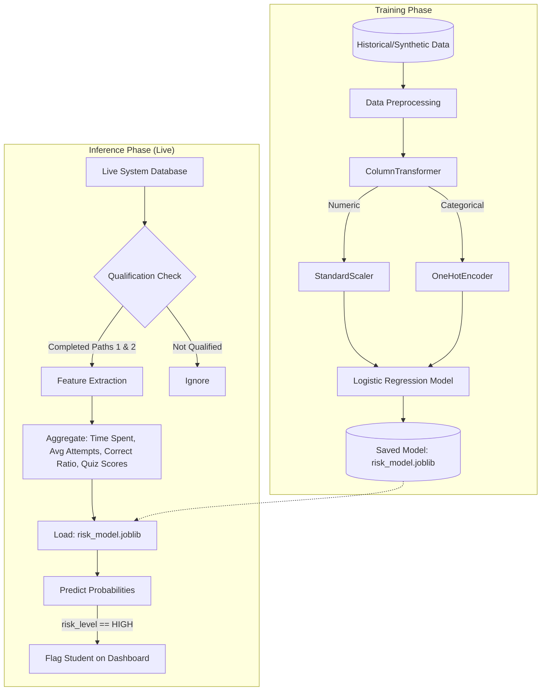
```mermaid
flowchart TD
    subgraph Training["Training Phase"]
        A[(Historical/Synthetic Data)] --> B[Data Preprocessing]
        B --> C[ColumnTransformer]
        C -->|Numeric| D[StandardScaler]
        C -->|Categorical| E[OneHotEncoder]
        D --> F[Logistic Regression Model]
        E --> F
        F --> G[(Saved Model: risk_model.joblib)]
    end

    subgraph Inference["Inference Phase (Live)"]
        H[Live System Database] --> I{Qualification Check}
        I -->|Completed Paths 1 & 2| J[Feature Extraction]
        I -->|Not Qualified| K[Ignore]
        
        J --> L[Aggregate: Time Spent, Avg Attempts, Correct Ratio, Quiz Scores]
        L --> M[Load: risk_model.joblib]
        M --> N[Predict Probabilities]
        N -->|risk_level == HIGH| O[Flag Student on Dashboard]
    end
    
    G -.-> M
```

**Flow Explanation:**
The ML Engine operates in two distinct phases:
1. **Training Phase**: The system utilizes historical or synthetic student data (`synthetic_training_data.csv`). A Scikit-learn pipeline preprocesses the data using a `ColumnTransformer` (applying `StandardScaler` to numeric features like execution time, attempts, and scores, and `OneHotEncoder` to categorical statuses). A Multinomial Logistic Regression model is then trained on these features to classify risk levels and saved as a `.joblib` artifact.
2. **Inference Phase (Live)**: During live operation, the `MLService` first identifies "qualified" students (those who have fully completed all topics in Learning Paths 1 and 2). For these students, the backend aggregates live metrics from the database (average exercise attempts, code execution time, correctness ratio, and quiz scores). These aggregated metrics form a feature vector which is passed to the pre-loaded `.joblib` model. The model outputs a pass probability and a discrete risk level (e.g., LOW, MEDIUM, HIGH). Students classified as "HIGH" risk are immediately flagged on the Trainer Dashboard for intervention.

#### 3.3 ML-Powered Risk Assessment & Intervention
This scenario outlines the proactive approach taken by the platform to identify and assist struggling students based on the data gathered during progress tracking.

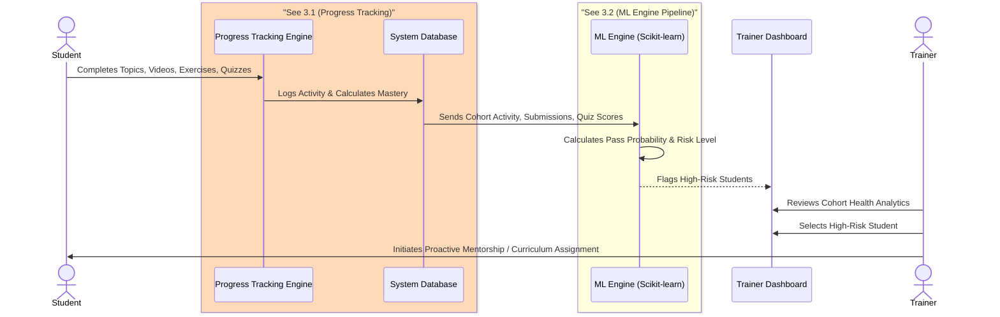
```mermaid
sequenceDiagram
    actor S as Student
    
    box PeachPuff "See 3.1 (Progress Tracking)"
    participant PT as Progress Tracking Engine
    participant DB as System Database
    end
    
    box LightYellow "See 3.2 (ML Engine Pipeline)"
    participant ML as ML Engine (Scikit-learn)
    end
    
    participant Dashboard as Trainer Dashboard
    actor T as Trainer

    S->>PT: Completes Topics, Videos, Exercises, Quizzes
    PT->>DB: Logs Activity & Calculates Mastery
    DB->>ML: Sends Cohort Activity, Submissions, Quiz Scores
    ML->>ML: Calculates Pass Probability & Risk Level
    ML-->>Dashboard: Flags High-Risk Students
    T->>Dashboard: Reviews Cohort Health Analytics
    T->>Dashboard: Selects High-Risk Student
    T->>S: Initiates Proactive Mentorship / Curriculum Assignment
```

**Flow Explanation:**
JS-Mentor proactively monitors student performance using a machine learning engine (built on Scikit-learn). The system database periodically feeds the ML model with student activity data, including cohort engagement, submission frequencies, and quiz scores. The model analyzes this data to calculate a pass probability and assigns a risk level to each student. High-risk profiles are flagged and surfaced on the Trainer Dashboard under Cohort Health Analytics. This allows trainers to quickly identify struggling students, drill down into their specific pain points, and initiate proactive mentorship or assign customized remedial curriculum to prevent them from falling behind.

### 4. Domain-Specialized AI Assistance
This flow demonstrates the strict domain boundaries enforced when a student interacts with the dedicated JS-Mentor AI.

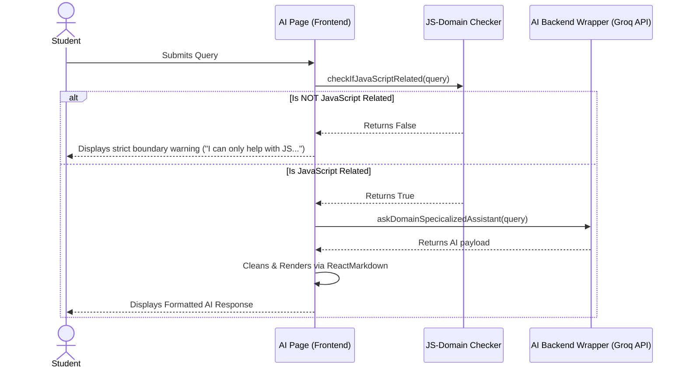
```mermaid
sequenceDiagram
    actor S as Student
    participant UI as AI Page (Frontend)
    participant C as JS-Domain Checker
    participant B as AI Backend Wrapper (Groq API)

    S->>UI: Submits Query
    UI->>C: checkIfJavaScriptRelated(query)
    
    alt Is NOT JavaScript Related
        C-->>UI: Returns False
        UI-->>S: Displays strict boundary warning ("I can only help with JS...")
    else Is JavaScript Related
        C-->>UI: Returns True
        UI->>B: askDomainSpecicalizedAssistant(query)
        B-->>UI: Returns AI payload
        UI->>UI: Cleans & Renders via ReactMarkdown
        UI-->>S: Displays Formatted AI Response
    end
```

**Flow Explanation:**
To maintain a focused learning environment, JS-Mentor enforces strict domain boundaries on its AI assistant. When a student submits a query to the AI Page, a dedicated Domain Checker first analyzes the prompt. If the query is deemed unrelated to JavaScript or web development, the system immediately returns a boundary warning, politely declining to answer. If the query is domain-relevant, the request is forwarded to the AI Backend Wrapper (powered by the Groq API) for specialized processing. The resulting payload is returned, cleaned, and rendered using ReactMarkdown, providing the student with a formatted, context-aware educational response.

### 5. AI-Powered Error Explanation (Compiler)
This scenario outlines how the platform assists students when they encounter runtime errors during coding exercises.

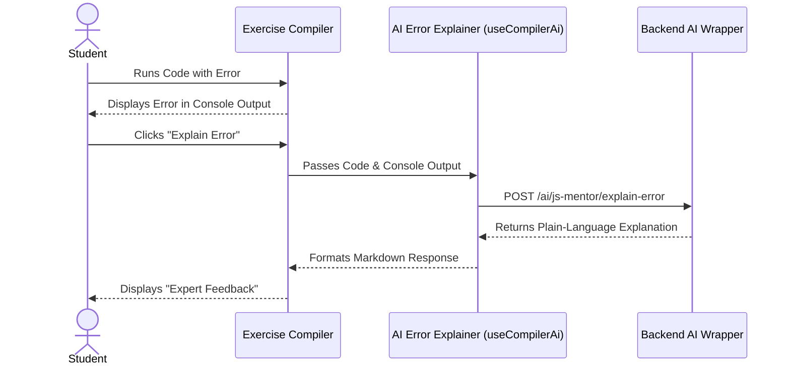
```mermaid
sequenceDiagram
    actor S as Student
    participant EC as Exercise Compiler
    participant AI as AI Error Explainer (useCompilerAi)
    participant B as Backend AI Wrapper

    S->>EC: Runs Code with Error
    EC-->>S: Displays Error in Console Output
    S->>EC: Clicks "Explain Error"
    EC->>AI: Passes Code & Console Output
    AI->>B: POST /ai/js-mentor/explain-error
    B-->>AI: Returns Plain-Language Explanation
    AI-->>EC: Formats Markdown Response
    EC-->>S: Displays "Expert Feedback"
```

**Flow Explanation:**
Debugging is a critical skill, and our Exercise Compiler aids this process via an AI Error Explainer. When a student executes code that results in a runtime error, the compiler outputs the raw stack trace. The student can click the "Explain Error" button, which bundles their current code and the console output and sends it to the AI Backend Wrapper. The backend queries the Groq API to generate a plain-language, beginner-friendly explanation of the error. This formatted markdown response is then rendered directly within the compiler interface as "Expert Feedback", helping the student understand the root cause without simply giving away the correct code.

### 6. Anti-Cheat Proctoring Engine
This flow tracks browser visibility, window focus, and viewport layout ratios to prevent cheating via external windows, side panels, or developer tools.

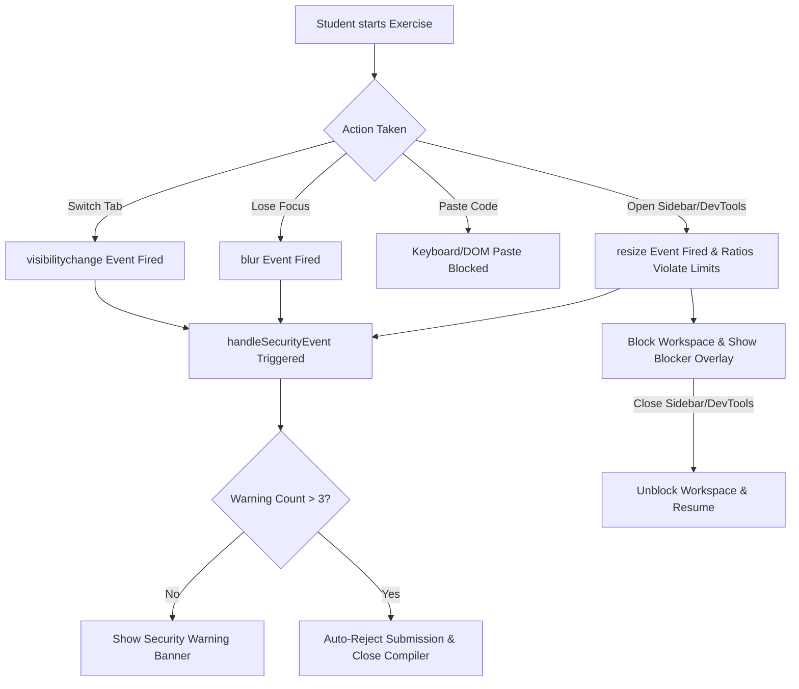
```mermaid
flowchart TD
    A[Student starts Exercise] --> B{Action Taken}
    B -- Switch Tab --> C[visibilitychange Event Fired]
    B -- Lose Focus --> D[blur Event Fired]
    B -- Paste Code --> E[Keyboard/DOM Paste Blocked]
    B -- Open Sidebar/DevTools --> K[resize Event Fired & Ratios Violate Limits]
    
    C --> F[handleSecurityEvent Triggered]
    D --> F
    K --> F
    K --> J[Block Workspace & Show Blocker Overlay]
    
    F --> G{Warning Count > 3?}
    G -- No --> H[Show Security Warning Banner]
    G -- Yes --> I[Auto-Reject Submission & Close Compiler]
    
    J -- Close Sidebar/DevTools --> L[Unblock Workspace & Resume]
```

**Flow Explanation:**
To ensure the integrity of coding exercises, the Anti-Cheat Proctoring Engine continuously monitors the student's environment. If a student attempts to switch tabs (triggering `visibilitychange`), minimize the window (`blur`), or paste code directly into the editor, the system intercepts the action and triggers `handleSecurityEvent`. Furthermore, the engine monitors viewport resizing to detect the opening of browser extension sidebars (like Gemini or Copilot) or Developer Tools. Each violation increments a warning counter and displays a security banner. If the warning count exceeds the maximum allowed limit (typically 3), the engine automatically rejects the submission and locks the compiler.

### 7. AI-Assisted Quiz Evaluation & Feedback
This flow breaks down the reactive, event-driven architecture behind the interactive quizzes, utilizing `MutationObserver` to intercept DOM changes and fetch contextual AI feedback.

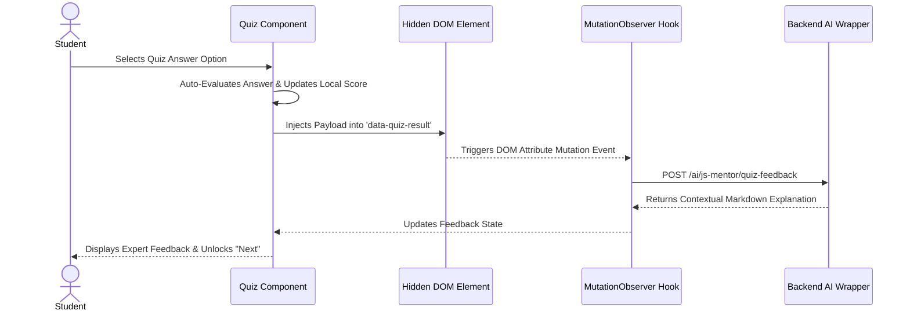
```mermaid
sequenceDiagram
    actor S as Student
    participant Q as Quiz Component
    participant DOM as Hidden DOM Element
    participant MO as MutationObserver Hook
    participant B as Backend AI Wrapper

    S->>Q: Selects Quiz Answer Option
    Q->>Q: Auto-Evaluates Answer & Updates Local Score
    Q->>DOM: Injects Payload into 'data-quiz-result'
    DOM-->>MO: Triggers DOM Attribute Mutation Event
    MO->>B: POST /ai/js-mentor/quiz-feedback
    B-->>MO: Returns Contextual Markdown Explanation
    MO-->>Q: Updates Feedback State
    Q-->>S: Displays Expert Feedback & Unlocks "Next"
```

**Flow Explanation:**
The Visual Quiz system utilizes a reactive, event-driven architecture to provide instant, contextual feedback. When a student selects an answer, the Quiz Component automatically evaluates the response and updates the local score. Simultaneously, it injects a specific payload into a hidden DOM element (`data-quiz-result`). A `MutationObserver` hook listens for changes to this attribute, intercepts the payload, and triggers an asynchronous POST request to the backend AI wrapper. The backend returns a detailed markdown explanation of why the selected answer was correct or incorrect. The hook updates the feedback state, displaying the expert explanation to the student and unlocking the "Next" button to proceed.

### 8. Video Tutorial Management & Rendering Flow
This section details how trainers publish video content and how the platform processes, stores, and presents these tutorials across the application with dynamic thumbnails. We've split this into two flows for clarity: Local Video Uploads (via Cloudinary) and YouTube Embeds.

#### 8A. Local Video Upload (Cloudinary) Flow

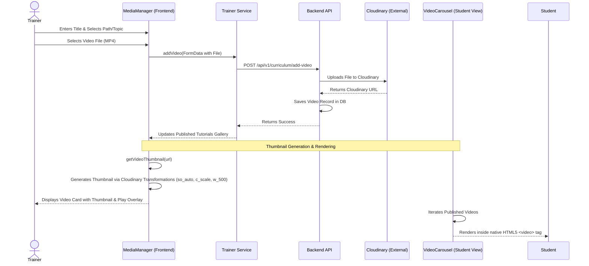
```mermaid
sequenceDiagram
    actor T as Trainer
    participant MM as MediaManager (Frontend)
    participant TS as Trainer Service
    participant B as Backend API
    participant C as Cloudinary (External)
    participant VC as VideoCarousel (Student View)

    T->>MM: Enters Title & Selects Path/Topic
    T->>MM: Selects Video File (MP4)
    MM->>TS: addVideo(FormData with File)
    TS->>B: POST /api/v1/curriculum/add-video
    B->>C: Uploads File to Cloudinary
    C-->>B: Returns Cloudinary URL
    B->>B: Saves Video Record in DB
    B-->>TS: Returns Success
    TS-->>MM: Updates Published Tutorials Gallery

    Note over MM,VC: Thumbnail Generation & Rendering
    
    MM->>MM: getVideoThumbnail(url)
    MM->>MM: Generates Thumbnail via Cloudinary Transformations (so_auto, c_scale, w_500)
    MM-->>T: Displays Video Card with Thumbnail & Play Overlay
    
    VC->>VC: Iterates Published Videos
    VC-->>Student: Renders inside native HTML5 <video> tag
```

**Flow Explanation:**
When a trainer uploads a local MP4 video file, the MediaManager frontend packages the file into a `FormData` object and sends it via the Trainer Service to the Backend API. The backend acts as a secure proxy, uploading the heavy video file to Cloudinary and receiving a robust delivery URL in return. This URL is saved in the database. For rendering thumbnails in the dashboard, the frontend dynamically modifies the Cloudinary URL with transformation parameters (`so_auto, c_scale, w_500`) to extract a lightweight poster frame. On the student side, the VideoCarousel iterates through the published videos and renders the Cloudinary URL natively inside an HTML5 `<video>` tag.

#### 8B. YouTube Embed Flow

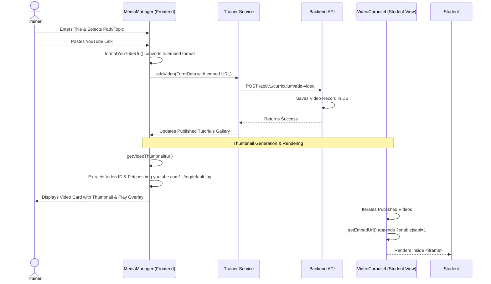
```mermaid
sequenceDiagram
    actor T as Trainer
    participant MM as MediaManager (Frontend)
    participant TS as Trainer Service
    participant B as Backend API
    participant VC as VideoCarousel (Student View)

    T->>MM: Enters Title & Selects Path/Topic
    T->>MM: Pastes YouTube Link
    MM->>MM: formatYouTubeUrl() converts to embed format
    MM->>TS: addVideo(FormData with embed URL)
    TS->>B: POST /api/v1/curriculum/add-video
    B->>B: Saves Video Record in DB
    B-->>TS: Returns Success
    TS-->>MM: Updates Published Tutorials Gallery

    Note over MM,VC: Thumbnail Generation & Rendering
    
    MM->>MM: getVideoThumbnail(url)
    MM->>MM: Extracts Video ID & Fetches img.youtube.com/.../mqdefault.jpg
    MM-->>T: Displays Video Card with Thumbnail & Play Overlay
    
    VC->>VC: Iterates Published Videos
    VC->>VC: getEmbedUrl() appends ?enablejsapi=1
    VC-->>Student: Renders inside <iframe>
```

**Flow Explanation:**
For YouTube tutorials, trainers simply paste the standard watch link into the MediaManager. A formatting utility instantly converts this link into a clean `/embed/` format. This URL is sent to the backend and saved directly in the database without requiring external uploading. When generating thumbnails for the Trainer Dashboard, the system extracts the unique video ID and fetches the standard medium-quality thumbnail directly from `img.youtube.com`. In the student's VideoCarousel, the embed URL is appended with `?enablejsapi=1` (to allow programmatic tracking of video completion) and rendered seamlessly inside an `<iframe>`.

### 9. Real-Time WebRTC Mentorship Signaling
This flow outlines the complex orchestration between Socket.IO (for reliable state management and signaling) and PeerJS (for heavy P2P media streaming and dynamic screen-share track replacement) during a 1-on-1 mentorship video call.

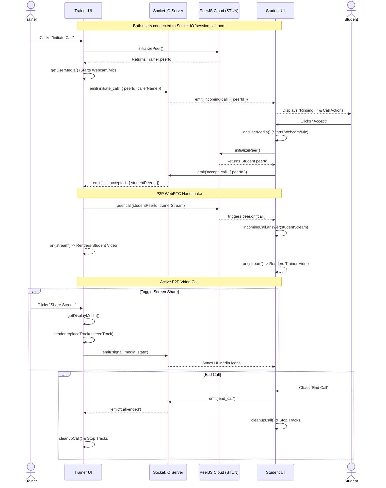
```mermaid
sequenceDiagram
    actor T as Trainer
    participant TS as Trainer UI
    participant S as Socket.IO Server
    participant P as PeerJS Cloud (STUN)
    participant SU as Student UI
    actor ST as Student

    Note over TS,SU: Both users connected to Socket.IO 'session_id' room
    
    T->>TS: Clicks "Initiate Call"
    TS->>P: initializePeer()
    P-->>TS: Returns Trainer peerId
    TS->>TS: getUserMedia() (Starts Webcam/Mic)
    TS->>S: emit('initiate_call', { peerId, callerName })
    S-->>SU: emit('incoming-call', { peerId })
    
    SU-->>ST: Displays "Ringing..." & Call Actions
    ST->>SU: Clicks "Accept"
    SU->>SU: getUserMedia() (Starts Webcam/Mic)
    SU->>P: initializePeer()
    P-->>SU: Returns Student peerId
    SU->>S: emit('accept_call', { peerId })
    S-->>TS: emit('call-accepted', { studentPeerId })
    
    Note over TS,SU: P2P WebRTC Handshake
    TS->>P: peer.call(studentPeerId, trainerStream)
    P-->>SU: triggers peer.on('call')
    SU->>SU: incomingCall.answer(studentStream)
    
    TS-->>TS: on('stream') -> Renders Student Video
    SU-->>SU: on('stream') -> Renders Trainer Video
    
    Note over TS,SU: Active P2P Video Call
    
    alt Toggle Screen Share
        T->>TS: Clicks "Share Screen"
        TS->>TS: getDisplayMedia()
        TS->>TS: sender.replaceTrack(screenTrack)
        TS->>S: emit('signal_media_state')
        S-->>SU: Syncs UI Media Icons
    end
    
    alt End Call
        ST->>SU: Clicks "End Call"
        SU->>S: emit('end_call')
        S-->>TS: emit('call-ended')
        SU->>SU: cleanupCall() & Stop Tracks
        TS->>TS: cleanupCall() & Stop Tracks
    end
```

**Flow Explanation:**
The 1-on-1 mentorship call relies on a sophisticated handshake between Socket.IO and WebRTC (PeerJS). When a trainer initiates a call, their UI requests a PeerJS ID and starts their local media stream, then emits an `initiate_call` event via Socket.IO. The student's UI receives this signal and displays a ringing notification. Upon accepting, the student initializes their own stream and PeerJS ID, sending an `accept_call` acknowledgment. The trainer then uses the student's peer ID to establish a direct P2P WebRTC connection (`peer.call`). Once connected, both peers receive and render each other's remote streams. If a user toggles screen sharing, the browser's `getDisplayMedia` API is called, and the new screen track dynamically replaces the webcam track on the active WebRTC sender, while Socket.IO broadcasts a signal to synchronize the mute/camera-off UI icons across both clients.

---

## ML Model & Dataset

### **Student Performance Prediction Dataset (JS-Mentor)**
**Algorithmically Correlated LMS Data for Early Intervention Modeling**

🔗 **Kaggle Dataset Link**: [Student Performance Prediction Dataset (JS-Mentor)](https://www.kaggle.com/datasets/suyashbaoney/student-performance-prediction-dataset)

#### **Context**
Identifying at-risk students before they fail is one of the most valuable applications of Machine Learning in EdTech. However, finding high-quality, continuous, and highly realistic educational datasets is notoriously difficult due to privacy constraints. 

This dataset was built for **JS-Mentor**, to train a predictive ML engine that flags at-risk students in real-time. Instead of relying on random noise, this dataset uses **True Generative Modeling** to simulate student behavior.

#### **⚙️ How the Data Was Generated (The Math)**
This data is not just randomized—it is mathematically correlated to reflect reality.

*   **The Hidden "Aptitude" Variable**: Under the hood, the generation script assigns a hidden, normally-distributed aptitude score to a simulated student.
*   **Realistic Correlations**: All independent variables are generated based on this aptitude score. This ensures that a student with high aptitude naturally finishes exercises faster, requires fewer attempts, and scores higher on quizzes, complete with real-world variance.
*   **The Sigmoid Function**: Features are passed through a linear combination $z$ and transformed via the Sigmoid function: <br><br>
    $$z = w_1 \cdot \text{score} + w_2 \cdot \text{attempts} + \dots$$ <br><br>
    $$\sigma(z) = \frac{1}{1 + e^{-z}}$$ <br><br>
*   **Calculated Risk**: The output of the Sigmoid becomes the `predicted_pass_probability`, which dictates the final `risk_level` (**HIGH**, **MEDIUM**, **LOW**).

Because the data is generated using rigorous mathematical coefficients, models like **Scikit-Learn's Logistic Regression**, **LightGBM**, or **XGBoost** can detect the underlying patterns and converge effectively.

#### **📊 Data Usability & Advantages**

##### **1. Behavioral Logic vs. Static Demographics**
Most popular student performance datasets rely heavily on lifestyle and socioeconomic factors (parental education, family size, etc.) to predict grades. While useful, these features are "static"—they describe a student's background but not their current struggle in the learning environment. 

**The LMS Advantage:**
*   **Active Interaction**: Instead of focusing on who the student is, this dataset captures **how they work**. Features like `avg_exercise_attempts` and `exercise_is_correct_ratio` act as immediate, high-signal proxies for cognitive load.
*   **LMS-Specific Metrics**: Fields such as `avg_exercise_execution_time_ms` allow models to differentiate between students writing working code slowly versus those writing efficient code—a nuance rarely found in educational data.

##### **2. Mathematical Integrity**
Many synthetic datasets use random noise, leading to "flat" models. 
*   **Algorithmic Correlation**: This data uses a latent "aptitude" variable that dictates a bell curve of performance.
*   **Sigmoid Alignment**: Because labels were assigned via a Sigmoid function, the dataset is a "perfect playground" for Logistic Regression and LightGBM models. It guarantees patterns exist without being "too easy."

##### **3. Ready for Real-World Deployment**
Designed to sync with professional LMS architectures:
*   **Production-Ready Schema**: The `progress_status` column follows an industry-standard ENUM system (`NOT_STARTED`, `IN_PROGRESS`, `COMPLETED`).
*   **Granular Risk Assessment**: Provides `predicted_pass_probability`, allowing for nuanced early-warning systems with custom "risk thresholds."

#### **Data Dictionary (ML Features)**

| Feature | Description |
| :--- | :--- |
| `student_id` | A unique identifier for the simulated student. |
| `progress_status` | Categorical state of the student's current module. |
| `time_spent_seconds` | Total time spent on the topic/editor. |
| `avg_exercise_attempts` | The average number of attempts required to solve an exercise. |
| `avg_exercise_execution_time_ms` | How fast the student's code executed (indicating code efficiency). |
| `exercise_is_correct_ratio` | The rolling average of first-attempt correctness. |
| `quiz_score` | The final or current score on the module's assessment. |
| `quiz_attempt_number` | Number of times the student has attempted the quiz. |
| `predicted_pass_probability` | The raw output of the Sigmoid generation function. |
| `risk_level` | The target label (HIGH, MEDIUM, LOW) assigned based on the pass probability. |

#### **🚀 Starter Notebook & Use Cases**
Check the **Code** tab on Kaggle for a complete **Starter Notebook** that walks through:
*   **Exploratory Data Analysis (EDA)** to prove feature correlations.
*   **Preprocessing** using Scikit-Learn’s `ColumnTransformer`.
*   **Training** a Multinomial Logistic Regression model to classify risk.

#### **Generative LLM Script**
Below is the backend Python script used to prompt an LLM to generate this mathematically correlated synthetic data:

<details>
<summary>Click to view <code>generate_training_data.py</code></summary>

````python
import os
import requests
import pandas as pd
from io import StringIO
from dotenv import load_dotenv
import time
import re

# Load environment variables
load_dotenv()

API_KEY = os.getenv("FASTAPI_GROK_API_KEY")
API_URL = os.getenv("FASTAPI_GROK_API_URL")
MODEL = os.getenv("FASTAPI_GROK_MODEL")

if not API_KEY or not API_URL:
    print("Error: API credentials not found in .env file.")
    exit(1)

def generate_synthetic_data(num_rows=25):
    prompt = f"""You are a data generation assistant. Generate exactly {num_rows} rows of synthetic data for training a Logistic Regression model to predict student pass/fail outcomes.

The CSV should have the following columns:
1. student_id (integer)
2. progress_status (IN_PROGRESS or COMPLETED)
3. time_spent_seconds (integer, 300 to 20000)
4. avg_exercise_attempts (float, 1.0 to 10.0)
5. avg_exercise_execution_time_ms (integer, 100 to 10000)
6. exercise_is_correct_ratio (float, 0.0 to 1.0)
7. quiz_score (float, 0.0 to 100.0)
8. quiz_attempt_number (integer, 1 to 5)
9. predicted_pass_probability (float, 0.0 to 1.0)
10. risk_level (LOW, MEDIUM, HIGH)

Logical rules for correlation:
- LOW risk: high exercise_is_correct_ratio, low avg_exercise_attempts, high quiz_score, COMPLETED status or moderate time_spent_seconds, predicted_pass_probability > 0.7.
- HIGH risk: low exercise_is_correct_ratio, high avg_exercise_attempts, low quiz_score, IN_PROGRESS status with high time_spent_seconds, predicted_pass_probability < 0.4.
- MEDIUM risk: predicted_pass_probability between 0.4 and 0.7.
- risk_level MUST strictly match the predicted_pass_probability bounds.

IMPORTANT: You MUST wrap your generated CSV data inside a markdown block like this:
```csv
student_id,progress_status,time_spent_seconds,...
1,COMPLETED,4000,...
```
Do NOT include any other text inside the CSV block.
"""

    headers = {
        "Authorization": f"Bearer {API_KEY}",
        "Content-Type": "application/json",
    }
    
    payload = {
        "model": MODEL,
        "input": prompt
    }

    try:
        response = requests.post(API_URL, headers=headers, json=payload, timeout=60)
        response.raise_for_status()
        data = response.json()
        
        generated_text = ""
        # Check standard and custom response structures
        if data.get("output") and isinstance(data["output"], list):
            for item in data["output"]:
                if item.get("type") in ["message", "reasoning"]:
                    content = item.get("content", [])
                    if content and len(content) > 0 and content[0].get("text"):
                        # If we found text, append it (sometimes reasoning + message are separate)
                        generated_text += content[0]["text"] + "\n"
                        
        if not generated_text and data.get("choices"):
            generated_text = data["choices"][0]["message"]["content"]
            
        if not generated_text:
            print("Failed to extract text from API response.")
            return None

        # DEBUG: Print the raw text to see what the LLM is actually returning
        print("=== RAW GENERATED TEXT START ===")
        print(generated_text[:1000]) # Print first 1000 chars to avoid flooding terminal
        print("=== RAW GENERATED TEXT END ===")

        # Extract CSV using regex
        match = re.search(r'```(?:csv)?\s*(.*?)\s*```', generated_text, re.DOTALL | re.IGNORECASE)
        if match:
            return match.group(1).strip()
            
        # Fallback if the LLM forgot the ```csv tag but included the header
        header_idx = generated_text.find("student_id,progress_status")
        if header_idx != -1:
            csv_str = generated_text[header_idx:]
            # Cut off at the next markdown block if present
            end_idx = csv_str.find("```")
            if end_idx != -1:
                csv_str = csv_str[:end_idx]
            return csv_str.strip()

        print("Could not find CSV block in the response.")
        return None

    except Exception as e:
        print(f"API Error: {e}")
        if 'response' in locals() and hasattr(response, 'text'):
            print(f"API Response: {response.text}")
        return None

if __name__ == "__main__":
    print("Starting data generation process...")
    # Generating 25 rows x 4 batches = 100 rows. Added sleep to prevent TPM rate limits.
    all_dfs = []
    
    for i in range(4):
        print(f"Generating batch {i+1}/4...")
        csv_data = generate_synthetic_data(25)
        
        if csv_data:
            try:
                df = pd.read_csv(StringIO(csv_data))
                # Validate it has the correct columns before appending
                if 'student_id' in df.columns and 'risk_level' in df.columns:
                    all_dfs.append(df)
                    print(f"Batch {i+1} successfully parsed ({len(df)} rows).")
                else:
                    print(f"Batch {i+1} parsed but missing expected columns.")
            except Exception as e:
                print(f"Error parsing batch {i+1} CSV: {e}")
        else:
            print(f"Failed to generate batch {i+1}.")
            
        if i < 3: # Don't sleep after the last batch
            print("Sleeping for 30 seconds to respect API rate limits...")
            time.sleep(30)
            
    if all_dfs:
        try:
            final_df = pd.concat(all_dfs, ignore_index=True)
            # Fix IDs to be strictly sequential 1 to N
            final_df['student_id'] = range(1, len(final_df) + 1)
            
            output_file = "synthetic_training_data.csv"
            final_df.to_csv(output_file, index=False)
            print(f"\nSUCCESS! Generated {len(final_df)} rows of training data.")
            print(f"Data saved to {output_file}")
            
            print("\nData Preview:")
            print(final_df.head())
        except Exception as e:
            print(f"Error saving combined data: {e}")
    else:
        print("No valid data was generated across all batches.")
````

</details>


## Evolution of the Project

### Phase 1: The Monolith MVP
- Started as a single-tier React application.
- Relied entirely on the client side for logic, delegating authentication and AI features directly to external APIs.
- Challenges included difficulty to scale, potential security vulnerabilities with client-side API keys, and limited customizability.

### Phase 2: Decoupling and Intelligence
- Introduced a dedicated Python FastAPI backend to act as a secure intermediary and handle heavy processing.
- Migrated from generic API wrappers to building custom LMS features: progress tracking, deterministic curriculum generation, and caching strategies.
- Integrated custom Machine Learning using logistic regression and generative dataset modeling to predict student performance and risk levels.


## Technical Stack

### Frontend (The Experience)
- **Framework**: React.js
- **Authentication**: Clerk (Role-based: Student/Trainer/Institute)
- **State Management**: Context API with persistent local storage
- **Visualization**: XYFlow (Quiz Logic), Chart.js (Analytics)
- **Communication**: PeerJS (WebRTC), Socket.io-client
- **Styling**: Modern, responsive UI with custom CSS (Glassmorphism, Vibrant Accents, and Light/Dark Mode support)

### Backend (The Engine)
- **API Framework**: FastAPI (Python)
- **Database**: PostgreSQL (Production) / MySQL (Dev)
- **Scheduling**: Custom Python-based logic engine with FIFO and Saturation strategies
- **ML Engine**: Scikit-learn for student risk prediction models
- **Deployment**: Dockerized services for scalable delivery

---


## Database ER Diagrams

To improve visibility, the database schema is divided into three core domains:

### 1. Core Profiles & Authentication

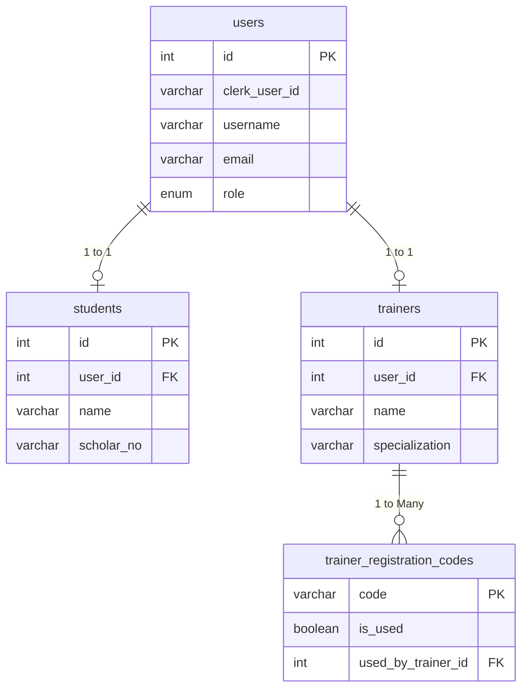
```mermaid
erDiagram
    users ||--o| students : "1 to 1"
    users ||--o| trainers : "1 to 1"
    trainers ||--o{ trainer_registration_codes : "1 to Many"

    users {
        int id PK
        varchar clerk_user_id
        varchar username
        varchar email
        enum role
    }
    students {
        int id PK
        int user_id FK
        varchar name
        varchar scholar_no
    }
    trainers {
        int id PK
        int user_id FK
        varchar name
        varchar specialization
    }
    trainer_registration_codes {
        varchar code PK
        boolean is_used
        int used_by_trainer_id FK
    }
```

### 2.1 Evaluation & Progress

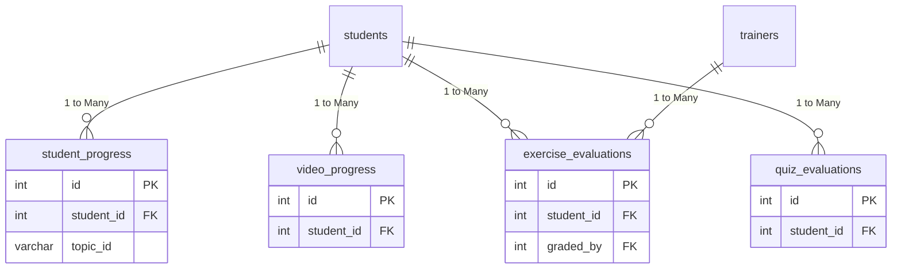
```mermaid
erDiagram
    students ||--o{ student_progress : "1 to Many"
    students ||--o{ video_progress : "1 to Many"
    students ||--o{ exercise_evaluations : "1 to Many"
    trainers ||--o{ exercise_evaluations : "1 to Many"
    students ||--o{ quiz_evaluations : "1 to Many"

    student_progress {
        int id PK
        int student_id FK
        varchar topic_id
    }
    video_progress {
        int id PK
        int student_id FK
    }
    exercise_evaluations {
        int id PK
        int student_id FK
        int graded_by FK
    }
    quiz_evaluations {
        int id PK
        int student_id FK
    }
```

### 2.2 Curriculum & Risk Predictions

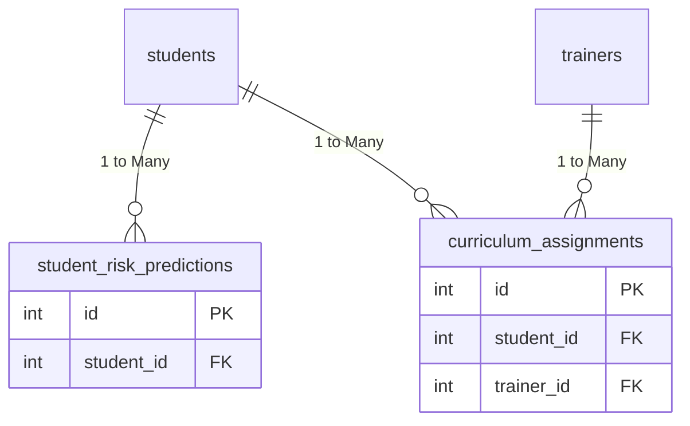
```mermaid
erDiagram
    students ||--o{ student_risk_predictions : "1 to Many"
    trainers ||--o{ curriculum_assignments : "1 to Many"
    students ||--o{ curriculum_assignments : "1 to Many"

    student_risk_predictions {
        int id PK
        int student_id FK
    }
    curriculum_assignments {
        int id PK
        int student_id FK
        int trainer_id FK
    }
```

### 3. Mentorship & Interaction

```mermaid
erDiagram
    trainers ||--o{ mentorship_sessions : "1 to Many"
    students ||--o{ mentorship_sessions : "1 to Many"
    students ||--o{ doubts : "1 to Many"
    trainers ||--o{ doubts : "1 to Many"
    mentorship_sessions ||--o{ doubts : "1 to Many"
    doubts ||--o{ doubt_replies : "1 to Many"
    users ||--o{ doubt_replies : "1 to Many"
    trainers ||--o{ media_tutorials : "1 to Many"

    mentorship_sessions {
        int id PK
        int trainer_id FK
        int student_id FK
    }
    doubts {
        int id PK
        int student_id FK
        int resolved_by FK
        int session_id FK
    }
    doubt_replies {
        int id PK
        int doubt_id FK
        int user_id FK
    }
    media_tutorials {
        int id PK
        int trainer_id FK
    }
```

---

## Data Dictionary

### Table Overviews

| Table Name | Description | Related Tables |
| :--- | :--- | :--- |
| **`users`** | Core authentication profiles mapping Clerk credentials to platform roles. | `students`, `trainers`, `doubt_replies` |
| **`students`** | Specific profiles for students containing academic details like scholar numbers. | `users`, `student_progress`, `exercise_evaluations`, `quiz_evaluations`, `student_risk_predictions`, `mentorship_sessions`, `doubts`, `curriculum_assignments`, `video_progress` |
| **`trainers`** | Specific profiles for trainers containing their specialized areas. | `users`, `trainer_registration_codes`, `exercise_evaluations`, `mentorship_sessions`, `doubts`, `curriculum_assignments`, `media_tutorials` |
| **`trainer_registration_codes`** | Pre-authorized codes used by trainers to register onto the platform. | `trainers` |
| **`student_progress`** | Tracks student progress and time spent across various learning paths/topics. | `students` |
| **`exercise_evaluations`** | Records student coding submissions, attempts, and grades provided by trainers. | `students`, `trainers` |
| **`quiz_evaluations`** | Logs student scores, attempts, and pass/fail statuses for visual quizzes. | `students` |
| **`student_risk_predictions`** | Stores machine-learning driven risk assessments and probability of student failure. | `students` |
| **`mentorship_sessions`** | Manages scheduled and active 1-on-1 sessions between trainers and students. | `trainers`, `students`, `doubts` |
| **`doubts`** | Represents individual queries or issues raised by students waiting for resolution. | `students`, `trainers`, `mentorship_sessions`, `doubt_replies` |
| **`doubt_replies`** | Chat messages and replies within a specific doubt thread. | `doubts`, `users` |
| **`curriculum_assignments`** | Links specific learning paths assigned to students by trainers with due dates. | `trainers`, `students` |
| **`media_tutorials`** | References external media tutorials (e.g., videos) uploaded or linked by trainers. | `trainers` |
| **`video_progress`** | Tracks the completion status and watched seconds for individual student video access. | `students` |

---

## Getting Started

### 1. Frontend Setup
The frontend of JS-Mentor is built with React.js and is developed on the `main` branch.

**1. Clone the repository and checkout the main branch:**
```bash
git clone https://github.com/suyash-rgb/JS-Mentor.git
cd JS-Mentor
git checkout dev
```

**2. Install dependencies:**
```bash
npm install
```

**3. Environment Configuration:**
Create a `.env` file in the root directory:
```env
REACT_APP_CLERK_PUBLISHABLE_KEY=your_clerk_key
REACT_APP_API_BASE_URL=http://localhost:
REACT_APP_GROQ_API_URL=your_groq_api_url
REACT_APP_GROQ_API_KEY=your_groq_api_key
REACT_APP_GROQ_MODEL=your_groq_model
```

**4. Start the Frontend Engine:**
```bash
npm start
```

### 2. Backend Setup
The backend is powered by FastAPI and is developed on the `backend` branch.

**1. Clone the repository and checkout the backend branch:**
*(If you already cloned it for the frontend, clone it in a separate folder or just switch branches if not running simultaneously)*
```bash
git clone https://github.com/suyash-rgb/JS-Mentor.git JS-Mentor-Backend
cd JS-Mentor-Backend
git checkout backend
```

**2. Set up Virtual Environment & Install Dependencies:**
```bash
python -m venv venv
# Activate venv: `venv\Scripts\activate` on Windows or `source venv/bin/activate` on macOS/Linux
pip install -r requirements.txt
```

**3. Environment Configuration:**
Create a `.env` file in the backend root directory containing:
```env
DATABASE_URL=your_database_url
SECRET_KEY=your_secret_key
JWT_ALGORITHM=your_jwt_algorithm
CLERK_SIGNING_SECRET=your_clerk_signing_secret
FRONTEND_URL=your_frontend_url
FASTAPI_GROQ_API_KEY=your_groq_api_key
FASTAPI_GROQ_API_URL=your_groq_api_url
FASTAPI_GROQ_MODEL=your_groq_model
CLOUDINARY_CLOUD_NAME=your_cloudinary_cloud_name
CLOUDINARY_API_KEY=your_cloudinary_api_key
CLOUDINARY_API_SECRET=your_cloudinary_api_secret
```

**4. Start the Backend Engine:**
```bash
uvicorn app.main:app --reload
```

---

## API Documentation 

The APIs are organized into the following core modular domains:
* **🤖 AI Wrapper**: Endpoints for Groq-powered Error Explanations and Domain Specialized Assistant.
* **☁️ Assets**: Endpoints for managing Cloudinary media uploads and cleanups.
* **🔐 Authentication**: Clerk Webhooks and Trainer Onboarding via Registration Codes.
* **📚 Curriculum Management**: Managing Learning Paths, Topics, Visual Quizzes, and Media/Video Uploads.
* **⚙️ General**: Health checks and general status routes.
* **📈 Machine Learning**: Scikit-learn Risk Assessment inference and predictions.
* **⏱️ Scheduling Engine**: The Automated Scheduling Engine for Doubts and live Chat/WebRTC coordination.
* **🧑‍🎓 Student Features**: Tracking Mastery, fetching assigned exercises, code submissions, and video progress.
* **🧑‍🏫 Trainer Tools**: Dashboard analytics, manual grading, session resolution, and availability management.

For a detailed, developer-friendly overview of backend endpoints, their required payloads, and example responses, please check out the official API Reference.

👉 **[View the full API Documentation](API_DOCS.md)**

---

## Contribution & Governance
We use a structured branching strategy:
- `main`: Production-ready frontend, stable releases.
- `backend-prod`: Backend with Postgres Config
- `backend`: Backend with MySQL Config

If you'd like to contribute, please create a new branch for your feature or bug fix and submit a Pull Request (PR) for review.

For more details, refer to the inline documentation and code comments throughout the repository.

If you need any help, have questions, or want to discuss ideas, feel free to reach out to me at [suyashbaoney58@gmail.com](mailto:suyashbaoney58@gmail.com).

---
*Developed for the JavaScript Community.*
