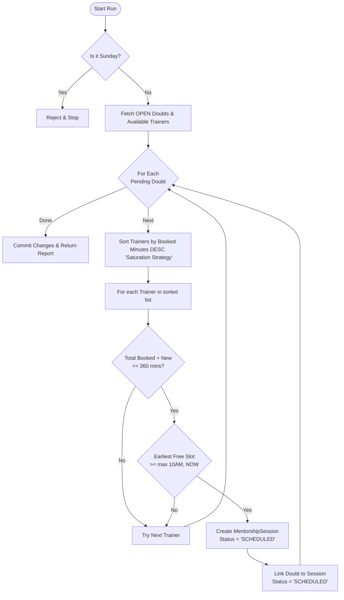

# Doubt Session Scheduling Logic

This document outlines the business logic and algorithmic flow for the JS-Mentor Doubt Scheduling Engine. The engine is designed to maximize trainer efficiency through a **Saturation & Dynamic Backfilling** strategy.

## ── Business Rules ──

1.  **Availability**: No doubt sessions are scheduled on **Sundays**.
2.  **Trainer Shifts**: The active window is **10:00 AM – 4:00 PM** (6 hours/day).
3.  **Durations**:
    *   Learning Paths 1 & 2 → **30-minute** sessions.
    *   Learning Paths 3 – 6 → **60-minute** sessions.
4.  **Priority**: Doubts are processed **FIFO** (oldest request first).
5.  **Saturation Strategy**: The engine fills one trainer's schedule completely before assigning tasks to the next available trainer.
6.  **Dynamic Backfilling**: If a session is resolved early or a trainer goes online mid-day, the engine can "tap into" the current time to fill newly available gaps.

---

## ── Algorithmic Flow ──

---

## ── Optimization Details ──

### 1. Saturation Sorting
Instead of spreading the load (Load Balancing), we sort trainers by their already booked minutes in **descending** order. This ensures that the engine tries to "top up" the trainer who is already working, keeping other trainers free unless necessary.

### 2. Dynamic "Now" Floor
When searching for an available slot (`_next_free_slot`), the engine uses `max(SESSION_START, CURRENT_TIME)`. This allows for **immediate scheduling** of new doubts into the current day's gaps, rather than waiting for the next day.

### 3. Reactive Triggers
The engine doesn't just run on a schedule. It is reactively triggered when:
*   A **Student** registers a new doubt.
*   A **Trainer** marks a session as resolved (freeing up their remaining time).

---

## ── Data Schema ──

*   **Trainer**: `is_available` (Boolean) - Manual toggle for trainers to participate in the queue.
*   **Doubt**: `status` ('OPEN', 'SCHEDULED', 'RESOLVED').
*   **MentorshipSession**: `status` ('SCHEDULED', 'ACTIVE', 'COMPLETED', 'CANCELLED').