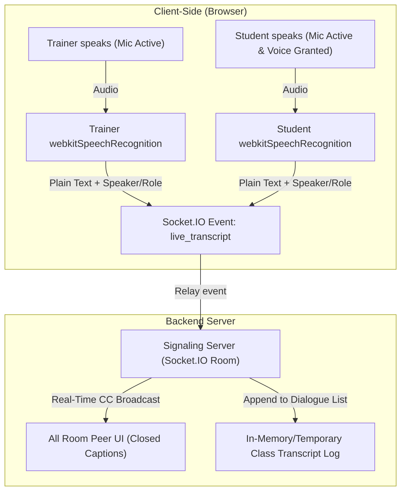
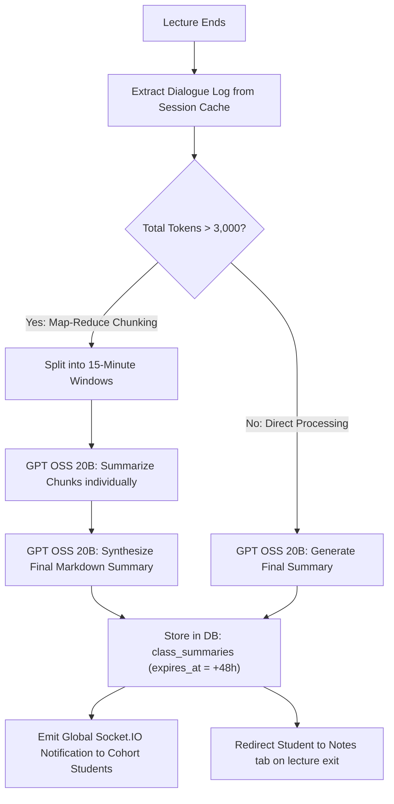
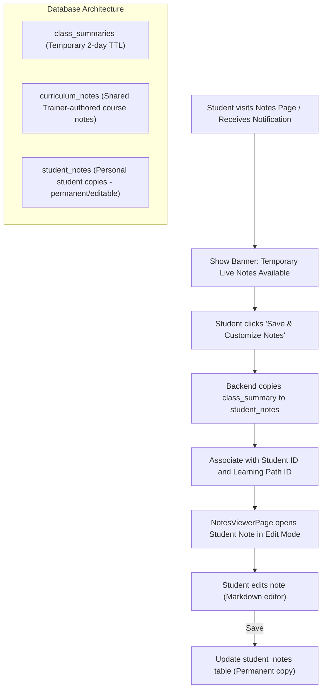

# Live Transcription & AI Class Summary System

This document outlines the zero-cost, low-latency architecture for live dialogue transcription, chunked AI summary generation via GPT OSS 20B, and student-editable notes persistence.

---

## 1. Live Dialogue Transcription Flow
Natively handles speech-to-text in the browser for unmuted trainers and students (when voice is granted), transmitting dialogue data in real time without audio-server overhead.



### Transcript Dialogue Format (JSON):
```json
{
  "id": 12,
  "speaker": "Rahul (Student)",
  "role": "student",
  "text": "Sir, why is the await keyword necessary here?",
  "timestamp": "16:22:18"
}
```

---

## 2. Chunked Summary Generation & Temporary Storage
Solves model token limit issues by chunking the transcript before processing, then saves the generated summary temporarily for 48 hours.



---

## 3. Student Persistence & Notes Editing Flow
Enables students to claim a temporary summary, copy it into their personal notes library, and edit it.


